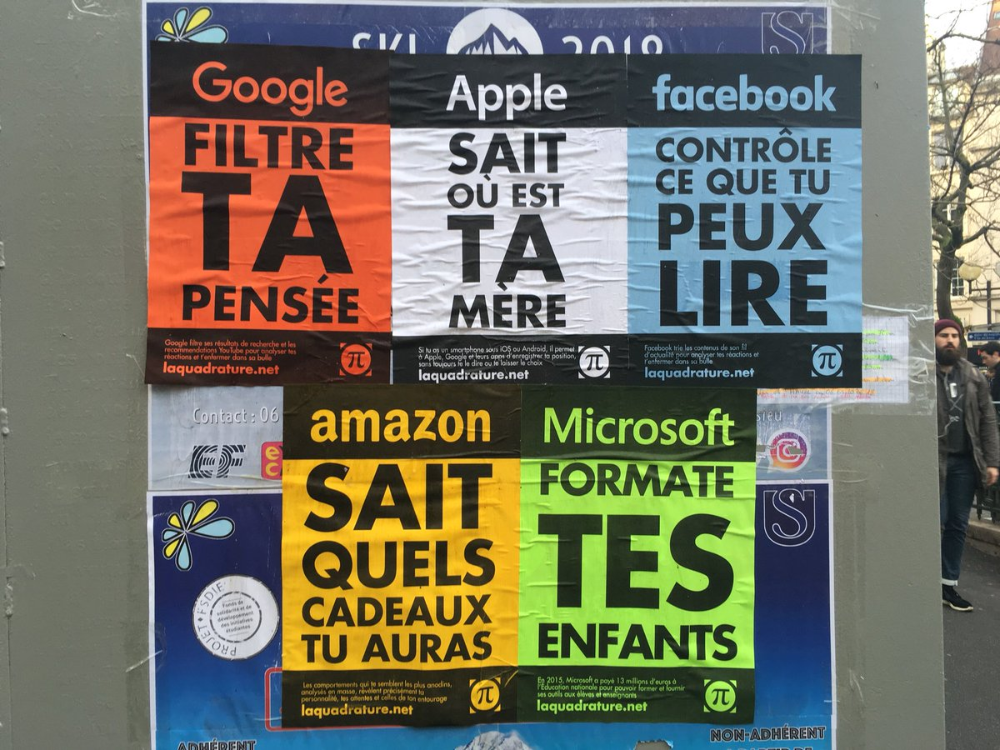
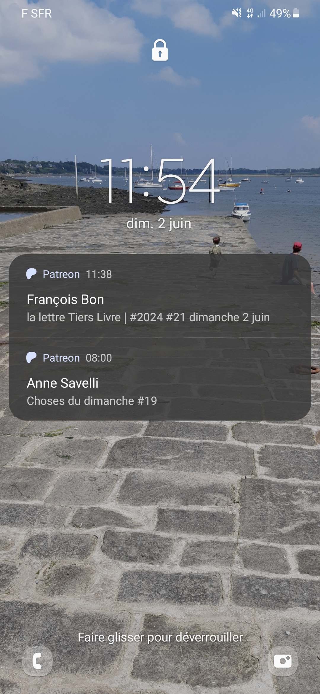

## "_Become a Patron..._"

### Gestion de projets littéraires et _community management_ sur Patreon

<!-- .element: style="width:300px" -->

§§§§§§§§§§§§§§§§§§§§§§§§§§§§§§§§§§§§§§§§§§§§§

### Management et littératures... "numériques" : les risques de l'auto-édition

<!-- .element: style="width:600px" -->

<!-- .element: style="width:60%;float:right;margin-right:-3em;" -->

>Zut alors : privé d’« assiette sociale ». J’avais une assiette sociale sans le savoir et je n’en ai plus.
Dingue : pour la 1ère fois depuis... 1986, JE NE SUIS PLUS auteur ni quedalle... bon, j’ai du vieux cuir tanné – et quelques états de service derrière moi, mais ça montre bien :
- 1, comment la précarisation des auteur.e.s touche globalement et massivement désormais TOUTE la profession ;
- 2, que le régime démerde ça va être massivement la règle pour tou.te.s les d’jeuns qui débarquent dans le métier ;

>Francois Bon, [Tiers Livre, 10 septembre 2018](http://www.tierslivre.net/spip/spip.php?article4777)

<!-- .element: style="font-size:1.5rem; width:50%;float:left;margin-left:-3em;" -->

===

Je commencerai par remercier les organisateurs de ce colloque de nous donner l'occasion de réfléchir à cette relation globalement impensée entre littérature et management, à l'exception de quelques travaux récents dont l'appel se faisait l'écho. Merci, car vous m'avez permis de me pencher sur une problématique que la communauté des chercheurs en littérature numérique pressent depuis maintenant plusieurs années, sans pour autant vraiment mettre les pieds dans le plat : l'organisation du travail des écrivains appartenant au champ de la littérature "numérique", leur rémunération, leurs compétences, ainsi l'évaluation de la valeur de leur "travail" littéraire, qui est également un travail de "création de contenus numériques", qui relève de ce que l'on appelle dans le champ littéraire de l'auto-édition. 

Pourtant, cette question est centrale. Anecdote : F. Bon qui perd son statut d'écrivain pour avoir trop publié en dehors des clous... ou l'écrivain qui ne rentre plus dans les cases de l'administration française. 

§§§§§§§§§§§§§§§§§§§§§§§§§§§§§§§§§§§§§§§§§§§§§

* Littératures numériques : pour une _approche par projet_

>La notion de projet met en avant une idée et une finalité à atteindre, dont elle déconstruit déjà des étapes et une progession : elle souligne le travail préparatoire et les moyens nécessaires à l'élaboration d'un produit final.  Désormais, c'est donc le projet qui fait œuvre, et transforme au passage le sens accordé à cette dernière - en particulier en bousculant ses enjeux de stabilité et de clôture 

<!-- .element: style="font-size:1.5rem; width:50%;float:right;margin-right:-3em;" -->

<!-- .element: style="width:60%;float:left;margin-left:-3em;" -->

===

J'avais prévu une introduction bcp trop longue où je balisais des concepts propres au champ de la littérature numérique, concept qui ont été assez important pour préparer les propos qui vont suivre, mais faut de temps j'ai tout enlevé ou presque. Je ne garderai qu'une seule remarque préliminaire : cela fait déjà quelque temps que pour parler des objets qui forment mon corpus, je ne parle plus d'œuvre littéraire, un concept plutôt issu du paradigme de l'imprimé, mais plutôt de projet littéraire. J'ai opéré ce choix en m'inspirant du vocabulaire et des pratiques de l'art contemporain, mais je réalise ici combien la notion d'*approche par projet* que je mobilise résonne avec les enjeux managériaux qui nous occupent. La notion de projet met en avant une idée et une finalité à atteindre, dont elle déconstruit déjà des étapes et une progession : elle souligne le travail préparatoire et les moyens nécessaires à l'élaboration d'un produit final, et bien souvent ouvert à la contribution, à la discussion -- bref, à une sorte de management participatif qui s'est généralisé dans le champ des littératures numériques. 

Sur un plan poétique, la notion de projet n'est pas neutre : elle déplace l'intérêt du lecteur sur le processus créatif plutôt que sur un artefact final. Désormais, c'est donc le projet qui fait œuvre, et transforme au passage le sens accordé à cette dernière -- en particulier en bousculant ses enjeux de stabilité et de clôture : la publication numérique a permis aux écrivains de développer une poétique du chantier, où le lecteur assiste à un nouveau type de performance, laquelle fait partie de l'expérience esthétique. Non seulement l’instabilité et le caractère inachevé du texte ne sont plus tabous, mais ils font même tout l’intérêt du texte littéraire en ligne : tâtonnements, hésitations, brouillons, ratés... la poétique littéraire en contexte de publication numérique revient à son sens premier, un art du *faire*, qui bénéficie d'une publication en temps quasi réel. L'approche par projet, en d'autres termes, est une conséquence directe de la littérature éditorialisée.

§§§§§§§§§§§§§§§§§§§§§§§§§§§§§§§§§§§§§§§§§§§§§

### Hypothèse de travail

Si on considère ce déplacement de l'expérience esthétique vers le *faire*, alors l'oeuvre numérique apparaît comme un art du management littéraire arrimé à des outils spécifiques : les plateformes, dont la conception technique et le formalisme éditorial n'ont plus grand-chose à voir avec une certaine "idée" de littérature héritée du paradigme imprimé. De par son incursion dans un écosystème numérique, l'écriture littéraire négocie avec un mode de gestion des contenus (directement issu du modèle CMS) et de gestion des communautés de lecteurs (principe du community mamagement) reposant sur une économie de l'attention qui lui était jusqu'à présent étrangère, mais qu'il lui faut apprendre à maîtriser et à adapter.

<!-- .element: style="font-size:1.4rem; text-align:justify" -->

### Qui/quoi manage qui/quoi ? 

===

**Dès lors, j'ai préparé ma communication autour d'une hypothèse de travail** :
Si on considère ce déplacement de l'expérience esthétique vers le *faire*, alors l'oeuvre numérique apparaît comme un art du management littéraire, un art cependant arrimé à des outils spécifiques : les plateformes, dont la conception technique et le formalisme éditorial n'ont plus grand-chose à voir avec une certaine "idée" de littérature héritée du paradigme imprimé. De par son incursion dans un écosystème numérique, l'écriture littéraire négocie avec un mode de gestion des contenus (directement issu du modèle CMS) et de gestion des communautés de lecteurs (principe du community mamagement) reposant sur une économie de l'attention qui lui était jusqu'à présent étrangère, mais qu'il lui faut apprendre à maîtriser et à adapter. C'est à cette tension entre la gestion du fait littéraire et la gestion du contenu et de la communauté littéraire que j'ai consacré ma réflexion, en concentrant mes remarques autour d'une plateforme peu connue, mais assez originale dans son genre, Patreon, dont j'explorerai le modèle en m'appuyant sur trois écrivains : François Bon, Anne Savelli, Anne Archet. Qui gère qui ou quoi dans la littérature des plateformes, qui établit une drôle de dynamique entre le CMS, l'interface, le créateur et son public ?  

§§§§§§§§§§§§§§§§§§§§§§§§§§§§§§§§§§§§§§§§§§§§§

### Profil &#8470;1 : François Bon

===

* F. Bon
Difficile et peut-être inutile de présenter François Bon, pionnier de la littérature numérique en France, explorateur de nombreux outils de publication numérique depuis les années 1990 : il est passé par toutes sortes de CMS et réseaux sociaux. Ses expérimentations lui ont valu la mauvaise surprise de ne plus répondre aux exigences administratives régissant le statut d'auteur. 

François Bon est sur Patréon depuis 2021. Je suis ses activités sur cette plateforme depuis 1 mois. Ou, plutôt, c'est mon collègue et ami Marcello Vitali-Rosati qui le suit depuis deux ans, avec un abonnement à CA$45.90 par mois. Je le remercie de m'avoir prêté ses codes d'accès pour cette recherche.

§§§§§§§§§§§§§§§§§§§§§§§§§§§§§§§§§§§§§§§§§§§§§

### Profil &#8470;2 : Anne Savelli 

===

Anne Savelli est peut-être un peu moins connue que François Bon, alors qu'elle est l'autrice de presque une vingtaine d'ouvrages publiés chez différents éditeurs en France. En 2022, son *Musée Marilyn* a paru aux éditions Incultes, et s'est trouvé en lice sur plusieurs prix littéraires. Comme la plupart des récits publiés par Anne Savelli, *Musée Marilyn* est le fruit d'un projet de longue date dont le chantier d'écriture s'est tenu essentiellement en ligne, sur remue.net, sur FenêtresOpenSpace, sur twitter, Facebook et Instagram pendant 7 ans. 

Anne Savelli est sur Patreon depuis un peu moins d'un an. Je la suis depuis la création de son compte, pour 5 euros par mois.

§§§§§§§§§§§§§§§§§§§§§§§§§§§§§§§§§§§§§§§§§§§§§

### Profil &#8470;3 : Anne Archet

===

Anne Archet est sans doute l'écrivaine que vous avez le moins de chance de connaître. Il s'agit d'une autrice franco-canadienne, qui sévit sous pseudonyme, un pseudonyme dont les consonances -- Anne Archet, anarchie -- vous éclairent sur le registre d'écriture de l'intéressée. Anne Archet construit depuis plusieurs années une oeuvre féministe et érotico-pornographique en ligne, bien que plusieurs de ses oeuvres aient également fait l'objet de publications imprimées. Si j'ai choisi de travailler sur Anne Archet, c'est parce qu'elle a fait partie de mon corpus d'étude il y a maintenant 8 à 10 ans, dans le cadre de recherche sur les écritures profilaires : les récits de soi, mais également les écrits de fictions, qui utilisaient les réseaux sociaux et les espaces profilaires comme lieu de création. Anne Archet, normalement, c'est donc ça (illustrer). 

§§§§§§§§§§§§§§§§§§§§§§§§§§§§§§§§§§§§§§§§§§§§§

<!-- .element: style="width:60%;float:left;margin-left:-3em;" -->

<!-- .element: style="width:60%;float:right;margin-right:-3em;" -->

*Profils d'Anne Archet sur Twitter et Facebook*

===

Une spécialiste du détournement des grandes plateformes, qui flirte avec les CGU des CMS ou des réseaux, dans une approche que l'on peut rapprocher des *tactical media* ou média tactiques. L'expression, forgée par Geert Lovink et David Garcia, renvoie à une stratégie d'occupation des grands médias dans l'esprit du « cheval de Troie », qui consiste à investir la plateforme pour mieux la torpiller, de l’intérieur. Autant dire que j'étais curieuse de voir ce que Patréon devenait sous son clavier.

Anne Archet est sur Patreon depuis 2017. Je la suis depuis quelques semaines également, pour 2$ par mois. Honte à moi, alors que je la suis depuis des années sur Facebook, sur Twitter et bien évidemment sur ses sites web, je n'avais jamais remarqué sa présence sur Patreon.

§§§§§§§§§§§§§§§§§§§§§§§§§§§§§§§§§§§§§§§§§§§§§

## La littérature des plateformes : vie et mort de l'utopie de la désintermédiation

<!-- .element: style="width:45%;float:right;margin-right:-1em;" -->

<!-- .element: style="width:45%;float:left;margin-left:-1em;" -->

===

Mais n'allons pourtant pas trop vite en besogne, et détaillons un peu cet objet dont je parle depuis tout à l'heure "littérature des plateformes". Avec le web 2.0, au tournant des années 2000, est apparu ce que la critique appelle la "3e génération de littérature numérique" : la littérature des plateformes.

La littérature des plateformes désigne l'ensemble des écrits numériques produits à l'aide d'outils d'édition et de publication ne nécessitant aucune compétence informatique. Ce que j'appelle compétence informatique ici renvoie à des capacités de codage et programmation. Je distingue la compétence informatique des compétences, ou plus précisément de la littératie numérique : la littératie numérique renvoie à une connaissance et une maîtrise davantage culturelle, philosophique, épistémique et politique des technologies numériques. Exemple : je ne suis incapable de programmer en C++, mais je sais que PageRank, l'algorithme de classement du moteur de recherche de Google, qui est programmé en C++, repose sur un principe d'indice de citation, qu'il s'agit donc d'un algorithme dit "d'autorité" selon Cardon. De là, je comprends comment le tri des informations sur Google est opéré, et je peux me permettre d'avoir un avis critique sur ce classement. Même si je n'en connais pas tous les biais dans le détail, j'en ai une idée sommaire qui me permet de ne pas considérer le moteur de recherche comme un oracle -- ni d'ailleurs comme un suppôt du capitalisme de la Silicon Valley.

§§§§§§§§§§§§§§§§§§§§§§§§§§§§§§§§§§§§§§§§§§§§§

>La littérature des plateformes ne requiert aucune compétence en édition numérique ou en programmation. Elle émerge et se diffuse sur des infrastructures éditoriales permettant d'écrire directement en langage naturel, sans s'embarrasser par des considérations informatiques. À cet égard, elle constitue un environnement privilégié pour l'auto-édition contemporaine.

<!-- .element: style="font-size:1.4rem; width:50%;float:left;margin-left:-3em;" -->

<!-- .element: style="width:60%;float:right;margin-right:-3em;" -->

===

La littérature des plateformes, de la même façon, ne requiert aucune compétence en édition numérique ou en programmation. Elle émerge et se diffuse sur des infrastructures éditoriales permettant d'écrire directement en langage naturel, sans s'embarrasser par des considérations informatiques. Cette caractéristique l'a d'ailleurs beaucoup desservi dans le champ de la littérature numérique, où les premières générations, qui avaient établi une relation consubstantielle entre littérarité et compétence informatique, l'ont pendant des années grandement décriées. La littérature des plateformes est, à cet égard, un environnement privilégié pour l'auto-édition contemporaine.

§§§§§§§§§§§§§§§§§§§§§§§§§§§§§§§§§§§§§§§§§§§§§

* Les CMS : Spip (infra réseau Remue : Tier Livre de F. Bon, Fenêtre OpenSpace d'A. Savelli, Fuir est une pulsion de G. Vissac), Wordpress, Blogger, Drupal, WattPad... 

<!-- .element: style="font-size:1.5rem; width:50%;float:left;margin-left:-3em;" -->

<!-- .element: style="width:60%;float:right;margin-right:-3em;" -->

===

On peut relever deux grands types d'infrastructures où émerge cette littérature des plateformes : 

* les CMS -- pour "content management system" ou, en français, système de gestion des contenus. Le plus ancien est blogger, le plus connu et répandu est Wordpress. Les plus "spécialisés", dans le champ littéraire, sont SPIP (infrastructure de Remue.net, du Tiers livre de François Bon, mais également d'une large partie de la communauté des écrivains "numériques" francophone ayant gravité autour de Remue) ainsi que le populaire WattPad, qui a surtout accueilli des communautés d'écrivains amateurs spécialisés dans la fiction.

§§§§§§§§§§§§§§§§§§§§§§§§§§§§§§§§§§§§§§§§§§§§§

* les médias ou réseaux sociaux : YouTube, Facebook, Twitter-X, Instagram, et plus récemment Twitch, Tik-Tok.

<!-- .element: style="font-size:1.5rem; width:50%;float:left;margin-left:-3em;" -->

<!-- .element: style="width:60%;float:right;margin-right:-3em;" -->

===

* Les médias ou réseaux sociaux : YouTube, Facebook Twitter-X, Instagram, et plus récemment Twitch ou TikTok. Là où le CMS a vocation à gérer les contenus, les médias sociaux gèrent d'abord des communautés -- on leur doit l'invention du terme de "community manager". 

Pour schématiser, le CMS relève de la gestion des contenus là où le réseau social implique la gestion des communautés. L'un comme l'autre repose sur une modélisation très forte des schémas de publication ou des relations sociales. Il s'agit d'outils particulièrement régulateurs, qui s'appuient sur des protocoles en vérité plutôt contraignants. 

§§§§§§§§§§§§§§§§§§§§§§§§§§§§§§§§§§§§§§§§§§§§§

* La littérature des plateformes : une écriture à contrainte

<!-- .element: style="width:500px" -->

===

À cet égard, on peut considérer la littérature des plateformes comme une littérature à contrainte, avec tout ce que comprend cette dernière, en termes de stimulation, mais également de limitation de l'écriture. Le 19 mai, sur son Patreon, Anne Savelli écrit :

>Nouvelles de Tokyo #2 (19 mai)
>"Racontez une histoire" me propose (m'ordonne ?) Patreon sous le titre de cet article. Justement, je me demande : à quel moment un voyage devient-il quelque chose à dire ? Avant le numérique, on envoyait une carte, une lettre, attendait le retour pour faire développer ses photos (je me souviens de la pellicule glissée dans une enveloppe à fenêtre, le nom de famille qu'il fallait donner pour récupérer ses tirages). La narration se déroulait intérieurement et, sans doute, se modifiait au fil du séjour. Par moments, on imaginait ce qu'on dirait, et à qui.

§§§§§§§§§§§§§§§§§§§§§§§§§§§§§§§§§§§§§§§§§§§§§

>*Patreon est une plateforme de soutien à la création (musique, podcasts, arts visuels, auteurs...) offrant accès réservé à des ressources proposées directement depuis les « coulisses de la création » des artistes soutenus, contenus produits spécialement ou making-of des travaux principaux. C’est basé sur l’échange de services, avec messagerie prioritaire et débats. De nombreux auteurs ou musiciens rejoignent eux aussi cette plateforme, n’hésitez pas à explorer ce qu’elles & ils proposent. Des échanges qui autorisent* **<u>une confidentialité et une professionnalité qui font du bien pour continuer à nourrir un web vivant, et assurer notre indépendance d’auteurs ou d’artistes dans un contexte de moins en moins favorable aux partages de terrain, aux risques non-consensuels de l’édition et de la diffusion, plus une désaffection de plus en plus amplifiée des institutions (ce n’est pas un reproche, juste un constat)</u>** : *alors merci de votre soutien, merci d’être avec nous dans l’aventure.*

<!-- .element: style="font-size:1.4rem; text-align:justify" -->

>François Bon, *Tiers Livre*, 4 avril 2021

<!-- .element: style="font-size:1.4rem; text-align:right" -->

===

Pourtant, la littérature des plateformes a pu entretenir une utopie fortement répandue dans le champ de la littérature numérique depuis quelques années : l'utopie de la publication dont, à la suite des travaux de Lionel Ruffel notamment, chercheurs et créateurs ont retenu une signification "étymologique" -- "rendre public". La publication, débarrassée des éditeurs qui en avaient fait un commerce, un business, entraînant dans son sillage la formalisation de concepts littéraires : celui de l'auteur, entre conception juridique et figure symbolique ; mais également celui d'oeuvre (dont la stabilisation et la fermeture n'ont cessé de croître). Cette utopie de la publication peut être rapprochée du concept de désintermédiation, décrit par Gilles Bonnet comme une "stratégie d’évitement des filtres traditionnels mis en place par la chaîne du livre" ou, pour faire court : le court-circuitage du bon vieil éditeur bourgeois à l'ancienne.

Le tout dans un contexte où le modèle de gestion des maisons d'édition a pu faire l'objet de nombreuses récriminations de la part des auteurs, dans un contexte paradoxal de professionnalisation et de précarisation de l'écrivain -- j'en cite ici un extrait chez François Bon.

>**[Patreon autorise] une confidentialité et une professionnalité qui font du bien pour continuer à nourrir un web vivant, et assurer notre indépendance d’auteurs ou d’artistes dans un contexte de moins en moins favorable aux partages de terrain, aux risques non-consensuels de l’édition et de la diffusion, plus une désaffection de plus en plus amplifiée des institutions (ce n’est pas un reproche, juste un constat)** 

Ainsi, lorsque Ruffel, par exemple -- mais il est question ici de tous les chercheurs, parmi lesquels je me range, qui travaillent sur les notions de littérature exposée, néo-littérature, littérature hors le livre... Lorsqu'avec Ruffel, donc, nous soutenons que "le littéraire aujourd’hui apparaît en très grande partie comme une arène conflictuelle composée d’une sphère publique hégémonique reposant sur l’imprimé et d’une multitude d’espaces publics contre-hégémoniques relevant plutôt d’une « littérature-brouhaha » (exposée, performée, in situ, multi-support)", il sous-entend que l'écrivain bénéficie d'une plus grande liberté d'action et de création, à la fois sur le plan esthétique et politique, lorsqu'il évolue au sein de ces espaces contre-hégémoniques.

En d'autres termes, la littérature des plateformes est travaillée par un idéal d'autogestion des écrivains ou créateurs de contenus, où s'entremêle à la fois des considérations esthétiques (liberté de création), mais également des revendications quant aux conditions de travail.

§§§§§§§§§§§§§§§§§§§§§§§§§§§§§§§§§§§§§§§§§§§§§

===

On sait pourtant bien que les choses ne sont pas si simples. L'utopie de désintermédiation a aussitôt laissé la place à une réintermédiation par les GAFAM, qui ont mis en place un véritable monopole de la publication numérique tous genres confondus -- entraînant d'ailleurs un brouillage des frontières traditionnelles entre les arts : l'écrivain numérique n'est plus vraiment celui qui produit de l'écrit, mais celui qui produit des contenus (textes, images, vidéo, données). 

§§§§§§§§§§§§§§§§§§§§§§§§§§§§§§§§§§§§§§§§§§§§§

===

Que les spécialistes de la littérature numérique eux-mêmes aient baptisé des "genres" de la littérature numérique à partir des noms de plateformes voire de leur marque (AutoBlographie, écriture profilaire, LittéraTube, Twittérature) est significatif d'une nouvelle hégémonie propre à l'écosystème de publication numérique.

La littérature des plateformes fait courir le risque d'une plateformisation de la littérature -- soit une production littéraire entièrement contrainte par les règles formelles et les CGU des espaces de publication, ainsi que par l'influence des lecteurs-usagers, qui nourissent autant qu'ils subissent les algorithmes fabriquant l'autorité en ligne. 

§§§§§§§§§§§§§§§§§§§§§§§§§§§§§§§§§§§§§§§§§§§§§

===

Simple exemple, j'ai travaillé cette conférence dans une bibliothèque publique, au WiFi de laquelle je me suis connectée -- et le site Web d'Anne Archet n'a jamais pu s'afficher : le système a cru que je consultais de la pornographie. Dans le même ordre d'idée, François Bon a quitté TikTok après avoir été censuré pour avoir lu un poème de Baudelaire. Il y quelques mois, Anne Savelli a perdu l'un de ses profils sur Instagram, qui avait été pourtant l'une des pierres angulaires de son projet Marylin. La plateforme l'a accusée de violer les règles de la plateforme.

Que les conditions matérielles d'une forme ou d'un produit éditorial impactent des contenus littéraires n'est pas inédit dans l'histoire de la littérature : chaque époque est marquée par le développement de nouveaux moyens de production et de diffusion du fait littéraire. La matière manage le contenu depuis le volumen. Ce que la plateformisation de la littérature implique, c'est une déprise supplémentaire liée à l'écosystème médiatique dans son ensemble. La plateforme n'est pas la seule à contraindre l'écriture, dans la mesure où elle est elle-même prise dans une dynamique d'éditorialisation qui exerce une influence sur les contenus, leur positionnement dans l'écosystème du web, leur "autorité" en ligne. Il y a donc dans les écritures numériques une stratification des logiques managériales, intriquant des structures techniques (les plateformes), des structures algorithmiques, des communautés d'internautes dont les actions en lignes, traduites en données, jouent un rôle essentiel.

§§§§§§§§§§§§§§§§§§§§§§§§§§§§§§§§§§§§§§§§§§§§§

## Le modèle patreon : la plateforme anti-plateformisation ? 

<iframe width="560" height="315" src="https://www.youtube.com/embed/rwvUjAv6pxg?si=yp2A1ashw56Zp0-O" title="YouTube video player" frameborder="0" allow="accelerometer; autoplay; clipboard-write; encrypted-media; gyroscope; picture-in-picture; web-share" referrerpolicy="strict-origin-when-cross-origin" allowfullscreen></iframe>

===

Patreon n'est pas une plateforme extrêmement populaire, que ce soit auprès du grand public ou des chercheurs. La littérature sur le sujet est pauvre, et j'ai eu peine à trouver des études approfondies utiles à mon propos : qq rares mentions dans des articles en français, plusieurs études dans le monde anglo-saxon. Mais l'orientation est souvent axée sur l'influence du _business model_, et sur des profils patreon consacrés aux contenus musicaux. Les rares fois où il est question de profils issus de la sphère littéraire, c'est toujours de la BD. Rien sur les créateurs de littérature native numérique.

Patreon a été créée en 2013. Initialement investie par le secteur musical, elle a séduit plusieurs écrivains, notamment des créateurs de BD, mais également certains auteurs-créateurs issus du web littéraire francophone. Elle appartient à la grande famille des plateformes de financement participatif, dont elle incarne un modèle assez mal connu : contrairement à Ulule, par exemple, qui va proposer des campagnes de financement sur projet avec des objectifs à atteindre en un temps limité (des paliers sont débloqués en échange de contreparties souvent gadget), Patreon opte pour un modèle de micro-contributions mensuelles (quelques euros) permettant aux porteurs de projets de s’assurer une rémunération régulière, sur le modèle du salaire. 

Les créateurs peuvent choisir parmi trois formules d'adhésion :
Lite, Pro et Premium. Patreon perçoit des revenus par le biais de ces plans : le plan lite 5%, tandis que Pro et Premium prélèvent respectivement huit et douze pour cent.

§§§§§§§§§§§§§§§§§§§§§§§§§§§§§§§§§§§§§§§§§§§§§

===

Concrètement, le créateur peut adapter les formules comme il le souhaite et, surtout, en personnaliser le nom. Chez François Bon, les trois formules sont déclinées ainsi :

* un abonnement 3.5$ par mois : un accès à la communauté Tier Livre, avec une newsletter, des réunions zoom hebdomadaires et un canal de communication direct avec François
* un abonnement à 22$ par mois, pour un accès aux "Ateliers d'écriture", qui est une sorte de coaching pour l'écriture littéraire
* à noter que la formule médiane propose la même chose, mais à tarif réduit pour les étudiants ou demandeurs d'emploi.

§§§§§§§§§§§§§§§§§§§§§§§§§§§§§§§§§§§§§§§§§§§§§

===

Chez Anne Savelli, les formules, baptisées Oloés, du nom d'un concept littéraire forgé par Savelli elle-même (pour désigner les lieux où l'on lit et où l'on écrit), se déclinent ainsi :  

* formule Oloé 1 : "au fil de la semaine" pour $5.50 CA, accès à un forum d'échange, à des textes et enregistrements inédits  
* formule Oloé 2 : faites entrer l'écriture pour $8 CA, avec un accès au podcast exclusif "Faites entrer l'écriture" (d'une durée moyenne de 25 minutes) trois mois avant sa parution en ligne. C'est un podcast où Savelli parle beaucoup des coulisses de son travail d'écrivain. C'est l'abonnement que j'ai choisi.  
* formule Oloé 3 : encore plus de contenus inédits, mais également une newsletter personnalisée.  

§§§§§§§§§§§§§§§§§§§§§§§§§§§§§§§§§§§§§§§§§§§§§

===

Chez Anne Archet, Anne Archet oblige, on a le choix entre des formules "Licorne -- caramel, chocolat ou or" qui, en plus d'une newletter mensuelle, offrent chacune des livres numériques. J'ai opté pour l'abonnement licorne caramel.

§§§§§§§§§§§§§§§§§§§§§§§§§§§§§§§§§§§§§§§§§§§§§

### Chers patrons, chères matronnes...

===

Le crowdfunding s'est largement répandu ces dernières années dans le secteur de la création, où il défend le principe d'une relation sur le long terme entre le créateur et son public selon une logique de mécénat qui ne fixe aucune durée de collecte ni d'objectifs précis à atteindre, comme la publication d'un livre ou d'un CD, par exemple. Comme on l'a rapidement évoqué, le nom même de la plateforme s'inscrit dans ce paradigme du mécénat, puisque *patreon* est une déformation de *patron*, en anglais, qui signifie donateur, mécène. En français, le terme peut porter à confusion, confusion avec laquelle Anne Archet s'amuse beaucoup, puisque chacun de ses posts sur la plateforme commence par une adresse à ses mécènes : "chers patrons, chères matronnes".

§§§§§§§§§§§§§§§§§§§§§§§§§§§§§§§§§§§§§§§§§§§§§

>Le mécénat se définit comme "le soutien matériel apporté, sans contrepartie directe de la part du bénéficiaire, à une oeuvre ou à une personne pour l'exercice d'activités présentant un intérêt général."

<!-- .element: style="font-size:1.5rem; width:50%;float:left;margin-left:-3em;" -->

<!-- .element: style="width:60%;float:right;margin-right:-3em;" -->

===

Pour être toute à fait franche, je ne suis pas certaine qu'un juriste serait tout à fait d'accord avec l'usage du terme "mécénat", qui renvoie d'abord à un statut juridique assez précis. Sur le site du ministère de la culture, on peut notamment lire que :

>Le mécénat se définit comme "le soutien matériel apporté, sans contrepartie directe de la part du bénéficiaire, à une oeuvre ou à une personne pour l'exercice d'activités présentant un intérêt général."

Tout repose sans doute sur l'interprétation du terme "contrepartie directe". Sur une plateforme de financement participatif comme Ulule, notre contribution financière nous donne droit à une contrepartie directe : le livre, le jeu de société ou les éponges bio que nous avons commandées, avec, pour nous inciter à donner davantage, des *goodies* de type autocollant ou totebag. Une fois, en soutenant un festival de littérature érotique féministe, j'ai même obtenu un porte-clé tricoté en forme de clitoris.

§§§§§§§§§§§§§§§§§§§§§§§§§§§§§§§§§§§§§§§§§§§§§

>Vous me faites gagner en autonomie et en sérénité (j'arrête de courir partout ET de monter des dossiers sans cesse !) 

>Vous me rendez maîtresse de mon destin (carrément !)

<!-- .element: style="font-size:1.5rem; width:50%;float:left;margin-left:-3em;" -->

<!-- .element: style="width:60%;float:right;margin-right:-3em;" -->

===

Notons que les rétributions sont beaucoup plus sérieuses et/ou symboliques sur Patréon. Il ne s'agit que de contenus artistiques, ou bien de "nouvelles" ou newsletters de l'artiste, qui s'apparentent bien souvent à des comptes-rendus d'activités. L'écrivain fournit la preuve qu'il ne procrastine pas, loin de là. L'activité littéraire y est ainsi présentée plus que jamais comme un travail, comprenant des tâches bien définies. En retour, le lecteur, le "patron", assure donc un revenu mensuel. 

Chacun de nos trois écrivains insiste ainsi, dans la présentation de leurs formules d'adhésion, sur l'autonomie que le système Patreon permet d'acquérir :

>Vous me faites gagner en autonomie et en sérénité (j'arrête de courir partout ET de monter des dossiers sans cesse !)

écrit Anne Savelli dans la présentation de l'abonnement Oloé 2 que j'ai choisi. Dans la description du 3e pallier à 11,50 $ / mois : 

>Vous me rendez maîtresse de mon destin (carrément !)

Le discours est similaire chez les autres. Ainsi, chez Anne Archet, notre contribution est supposée nous offrir une rétribution symbolique, mais non moins importante : "La satisfaction d'appuyer Anne".

§§§§§§§§§§§§§§§§§§§§§§§§§§§§§§§§§§§§§§§§§§§§§

### Le paradigme du "patron" [Mécène] 
#### Une contre-culture participative ? 

|Artiste|Nombre total de membres|Membres payants|Publications|
|:--------------- |:---------------:|:---------------:| -----:|
|François Bon|494|271|584|
|Anne Savelli|81|32|*nr*|
|Anne Archet|105|63|*nr*|

<!-- .element: style="font-size:1.5rem; width:50%;float:left;margin-left:-3em;" -->

<!-- .element: style="width:60%;float:right;margin-right:-3em;" -->

===

Au niveau managérial, la logique de Patreon avec sa communauté fermée et limitée parait donc relativement originale, puisqu'elle va impliquer ce que je qualifierai de contre-culture participative. Je m'explique : dans le contexte de l'économie de l'attention où la participation des publics apparaît comme un levier essentiel de captation durable des publics, les industries culturelles et les créateurs redoublent d'efforts pour générer de l'interaction avec les internautes, via les plateformes de diffusion des contenus. C'est ce que Marta Severo a notamment qualifié d'impératif participatif : permettre la participation n'est plus seulement un moyen de gagner de l'audience, c'est aussi un moyen de gagner en légitimité. Le paradigme participatif s'accompagne par ailleurs d'un idéal de renversement de l'autorité, désormais déclinée selon un modèle horizontal et non plus vertical. Chez le sociologue Dominique Cardon, c'est bien certains modèles de plateforme -- notamment le CMS wiki de Wikipédia -- qui amène les usagers à pratiquer l'autogouvernance et à réguler l'écriture encyclopédique.

Pourtant, l'impératif participatif a ses revers : la participation, du fait de la plateformisation croissante, est de plus en plus régulée. Ainsi, pour Adam Fish, la culture participative initiée dans le cadre d'un paradigme démocratique et d'une horizontalisation des échanges, serait désormais assimilée par une logique du capital (sa thèse est détaillée dans l'ouvrage *Technolibéralism. The End of participatory culture*).

§§§§§§§§§§§§§§§§§§§§§§§§§§§§§§§§§§§§§§§§§§§§§

>Nota 2 : c’est aussi le soutien que représente à mes activités cet espace #Patreon qui m’a permis de désactiver le plus totalement possible les publicités parasites sur ma chaîne YouTube, désormais le poumon respirant du site. Pour cela aussi, merci. 

<!-- .element: style="font-size:1.7rem; text-align:justify" -->

>François Bon

<!-- .element: style="font-size:1.7rem; text-align:right" -->

===

Dans un tel contexte, Patreon n'incarnerait-il pas la fin de la culture de la participation, en réintégrant l'idée d'un espace fermé, un salon littéraire sélect, renouant ainsi avec la notion habermasienne d'espace public Bourgeois ? J'ai l'intuition que c'est un peu plus compliqué que cela. **Patreon est présenté par les créateurs eux-mêmes comme une solution permettant de gagner en autonomie, tant sur un plan qualitatif (la liberté de création faisant partie du contrat passé avec le "patron") que quantitatif (puisque la rétribution n'est pas liée à la popularité ou au calcul de l'audience des contenus).** Cette autonomie ressurgit d'ailleurs positivement sur les autres plateformes, dont le modèle économique repose sur le tiers acteur : 

>Nota 2 : c’est aussi le soutien que représente à mes activités cet espace #Patreon qui m’a permis de désactiver le plus totalement possible les publicités parasites sur ma chaîne YouTube, désormais le poumon respirant du site. Pour cela aussi, merci. (F. Bon)

Là où le recrutement et l’activation de la participation des internautes est une préoccupation majeure des gestionnaires de plateformes créatives et des organisateurs d’opérations participatives, la plateforme Patreon aurait donc tendance à diminuer les effets de surproduction et de spectacularisation. Semble ainsi se jouer une sociabilité d'un genre un peu nouveau -- ou pas tant que ça : F. Bon parle d'un retour aux "premiers temps du web".

§§§§§§§§§§§§§§§§§§§§§§§§§§§§§§§§§§§§§§§§§§§§§

## Relation parasociale et utopie du collectif

===

Comment les relations entre l'écrivain et le lecteur, le patron-mécènne, sont-elles organisées et gérées ? 

Rappel : La littérature des plateformes accompagne les mutations profondes de la présence sociale de l'écrivain dans l'espace public. La présence en ligne des auteurs, généralement sur des réseaux sociaux caractérisés par un flux conversationnel continu, implique une prise en charge l'identité auctoriale, qui tend à se confondre avec l'identité numérique. Ces écritures profilaires, qui échappent de plus en plus aux éditeurs, jusque-là seuls responsables de la médiatisation de l'écrivain, représentent un travail quotidien, parfois risqué, tant la gestion des communautés numérique implique un savoir-faire à part entière.

Comme les CMS, les réseaux sociaux ont également nourri un discours de la désintermédiation : sur Twitter, FaceBook, le lecteur ou le fan serait en mesure d'échanger "directement" avec son artiste favori. La communauté Des travaux ont nuancé cette relation directe, en requalifiant de "parasociale" la relation qui unit les créateurs de contenus et leurs *follower*. Ce concept de relation parasociale, d'abord issu de l'analyse psychologique des téléspectateurs dans les années 1960, décrit le phénomène par lequel une personne développe un sentiment d’intimité avec une figure médiatique ou fictive qui n’a pourtant pas vraiment conscience de son existence. Le _community management_ repose sur l'exploitation de cette relation parasociale, en jouant sur le registre de l'intime : tout est fait pour que le public développe un sentiment de proximité avec l'émetteur du message. Les influenceurs, mais également les créateurs de contenus en tout genre, gagnent leur vie en monétisant la relation parasociale. 

Sur Patreon, l'accent est mis sur la promesse d'une sociabilité plus authentique, garantissant un accès direct au créateur. François Bon insiste : "le Patreon autorise une relation directe et un autre espace d'expérimentation privilégiée." L'abonnement garantit un "accès à la messagerie privée avec priorité de mon côté." 

§§§§§§§§§§§§§§§§§§§§§§§§§§§§§§§§§§§§§§§§§§§§§

<!-- .element: style="width:600px" -->

===

Soyons clair, il me semble qu'une plateforme, parce qu'elle est plateforme est que c'est dans sa nature de modéliser des relations sociales pour en automatiser certains aspects, impliquera toujours à des degrés plus ou moins divers des relations parasociales, fondées sur une intimité plus ou moins à sens unique. Cela étant dit, il est intéressant je crois de confronter ce concept communicationnel de relation parasociale à notre concept littéraire de pacte de lecture, pour voir ce qu'il en ressort dans le cadre de notre réflexion sur le management. 

§§§§§§§§§§§§§§§§§§§§§§§§§§§§§§§§§§§§§§§§§§§§§

===

Si l'on s'en tient à l'interface de Patreon, on observe plusieurs espaces et protocoles dédiés aux échanges avec les créateurs. Outre les traditionnels espaces de commentaires sous les posts, Patreon offre la possibilité de rajouter une brique de chat (discord / slack). Le succès n'est pas toujours garanti, comme on peut le voir ici avec une capture du patréon d'Anne Savelli, qui s'est essayée à lancer une discussion dans le chat avec sa communauté, sans rencontrer forcément le succès attendu. Le dispositif fonctionne beaucoup mieux chez François Bon, sans doute parce que les chats interviennent comme support et complément d'événements, généralement des live-streaming, comme sur twitch, finalement. C'est là une des caractéristiques de Patréon : la publication s'établit sur un rythme régulier et non au fil de l'eau dans un flux continu. Il s'agit de véritable rendez-vous entre le créateur et sa communauté.

§§§§§§§§§§§§§§§§§§§§§§§§§§§§§§§§§§§§§§§§§§§§§

<!-- .element: style="width:320px" -->

===

Ainsi, à titre de lectrice, je suis particulièrement sollicitée par mes auteurs les dimanches, jour de publication des newsletters et de certains contenus exclusifs, notamment les podcasts d'Anne Savelli. Difficile d'y échapper : je reçois un email ainsi que des notifications directement sur mon téléphone, juste après avoir donné le biberon de lait au chocolat à mon fils. De quoi me laisser penser qu'il ne vaut mieux pas multiplier les abonnements, comme j'ai pu le pratiquer par ailleurs sur d'autres réseaux sociaux. Patreon présente un fort degré d'exigence envers ses lecteurs. Mais cette exigence est partagée. Sur Patréon, on ne tape pas la discute, on bosse, on progresse ensemble.

Patreon est une plateforme où s'expose comme rarement la professionnalisation du métier d'écrivain, dont il s'agit de montrer selon François Bon les « coulisses de la création », coulisses à la fois poétiques & esthétiques mais également matérielles et administratives. 

§§§§§§§§§§§§§§§§§§§§§§§§§§§§§§§§§§§§§§§§§§§§§

<!-- .element: style="width:60%;float:right;margin-right:-3em;" -->

<!-- .element: style="width:60%;float:left;margin-left:-3em;" -->

===

Selon un rythme régulier, généralement hebdomadaire, les écrivains publient ainsi des contenus destinés à tenir au courant leurs "Patrons" de l'avancement de ses projets. Ces publications relèvent du genre diaristique, entremêlant des données factuelles sur l'organisation du travail d'écriture, mais également des confessions personnelles. 

§§§§§§§§§§§§§§§§§§§§§§§§§§§§§§§§§§§§§§§§§§§§§

>De retour de Clermont, le lundi, je suis bien décidée à entamer le programme de travail lié à *Bruits*, programme qui, je le signale, n’a pourtant rien de faramineux, mais voilà que toute énergie se fait la malle, comme au temps du *burn out*. Mauvais sommeil, corps vampirisé, cerveau en jachère, etc. Je résiste, fais sonner le réveil chaque jour à la même heure, me lève et tente de faire ce que j’ai prévu, de suivre ma ligne. Un jour, deux jours, trois jours.

<!-- .element: style="font-size:1.5rem; width:50%;float:left;margin-left:-3em;" -->

<!-- .element: style="width:60%;float:right;margin-right:-3em;" -->

===

Chez Anne Savelli, par exemple, qui organise rigoureusement son travail, il est régulièrement fait part des difficultés psychiques et physiques de l'écrivaine, dont l'activité apparaît soumise aux mêmes risques de maladie professionnelle que n'importe quel autre métier :

>De retour de Clermont, le lundi, je suis bien décidée à entamer le programme de travail lié à *Bruits*, programme qui, je le signale, n’a pourtant rien de faramineux, mais voilà que toute énergie se fait la malle, comme au temps du *burn out*. Mauvais sommeil, corps vampirisé, cerveau en jachère, etc. Je résiste, fais sonner le réveil chaque jour à la même heure, me lève et tente de faire ce que j’ai prévu, de suivre ma ligne. Un jour, deux jours, trois jours.

§§§§§§§§§§§§§§§§§§§§§§§§§§§§§§§§§§§§§§§§§§§§§

>J’insiste, je me bats, je m’en fous, il faudra bien que ça plie : voilà le mantra. Je continue à mettre le réveil toujours à la même heure, à me lever comme si de rien n’était. Je tente de suivre mon programme "par blocs" (consacrer un temps précis, toujours le même, à une seule activité) à la lettre, quitte à en rabattre sur le rendement, mais le corps et le psychisme insistent, eux aussi, et m’écrasent de plus en plus. 

<!-- .element: style="font-size:1.5rem; width:50%;float:left;margin-left:-3em;" -->

<!-- .element: style="width:60%;float:right;margin-right:-3em;" -->

===

Ainsi des maux sans doute assez anciens -- syndrome de la page blanche -- se trouvent-ils traduits, et peut-être normalisés, sous le terme de *burn out*, reconnu comme une maladie professionnelle.

>J’insiste, je me bats, je m’en fous, il faudra bien que ça plie : voilà le mantra. Je continue à mettre le réveil toujours à la même heure, à me lever comme si de rien n’était. Je tente de suivre mon programme "par blocs" (consacrer un temps précis, toujours le même, à une seule activité) à la lettre, quitte à en rabattre sur le rendement, mais le corps et le psychisme insistent, eux aussi, et m’écrasent de plus en plus. 

§§§§§§§§§§§§§§§§§§§§§§§§§§§§§§§§§§§§§§§§§§§§§

<!-- .element: style="width:570px" -->

===

François Bon est sans doute celui de nos trois écrivains qui déploie le plus loin l'exposition de sa "fabrique" du fait littéraire. Son Patreon est en effet devenu l'interface privilégie de son école de création à distance : ce qu'il range dans la catégorie des Ateliers. Je ne développerai pas davantage ce point qui me semblerait mériter une étude à part entière, plus approfondie, avec l'abonnement qui va avec (et que je n'ai pas), mais j'ai l'impression que François Bon met en place ce qui pourrait être qualifié de *coaching d'écriture*, qui relève sans doute bien plus de ce qui peut se passer dans une salle de classe que sur un réseau social. [CITER EXTRAIT]

>Mise en lecture ce dimanche 19 mai : note d'intention et PDF à télécharger de deux textes de Chantal Tran : L'attente et Le retour, et d'un nouveau texte d'Emmanuelle Cordoliani, Alice A.

>Et si on musclait la formule ?

>Je souhaiterais, à mesure que ces rendez-vous se font plus riches et vont plus loin dans l'accueil et l'échange, qu'on réduise l'écart entre les manuscrits ou projets, et leur publication, en accueillant, dans ces mêmes séances de discussion, aussi bien (qui veut) des textes parés à l'envoi édition, ou bien, et c'est ce qu'on tentera le 27, les livres juste publiés de nos abonné·e·s.

>On a pris l'habitude de se rythmer, ce serait, de 18h15 à 19h45, les premières 30 minutes pour les 2 livres de Perle Vallens (Peggy M.) et Mireille Piris (avec Julotte Roche, Deux qui lisaient la mer), présentés par elles-mêmes. Puis, comme nous le faisions dans nos heures chrono, 30 minutes pour chacun des deux projets.

François Bon apparaît ainsi comme le chef d'orchestre ou l'animateur d'un petit groupe d'amateurs éclairés, et même davantage : d'autres créateurs en devenir.

En d'autres termes, **là où la plupart des plateformes créatives et de financement participatif jouent sur la monétisation de la relation parasociale qui se crée entre le créateur et sa communauté, à partir d'une mise en scène de l'intime, Patréon joue sur la carte de la professionnalisation, et valorise un discours du travail. Il me semble à cet égard que la plateforme est sans doute la plus à même de renouer avec un certain esprit du salon littéraire -- métaphore souvent avancée, de manière trop poussive à mon sens, pour qualifier les forums en ligne puis les différentes plateformes d'écriture et enfin les réseaux sociaux.**

§§§§§§§§§§§§§§§§§§§§§§§§§§§§§§§§§§§§§§§§§§§§§

#### Todo-list

- [ ] Explorer le backoffice de la plateforme (_critical code studies_ / _platform studies_)

- [ ] Accéder aux données (gestion quantitative du lecteur, de l'écriture)

- [ ] Réaliser un atelier d'écriture avec F. Bon

<!-- .element: style="font-size:1.7rem; text-align:justify" -->

===

Pas de conclu, mais une todo-list pour approfondir les recherches...

%%%%%%%%%%%%%%%%%%%%%%%%%%%%%%%%%%%%%%%%%%%%%

  Merci !
