## "Passez au niveau supérieur"

### Le discours de l'indépendance journalistique à l'ère post-internet

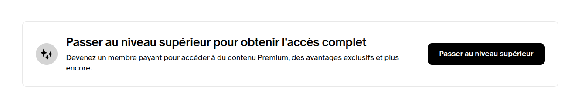

===

"Passez au niveau supérieur" : pourquoi ce titre ? Il vient d'une injonction que je ne cesse de rencontrer depuis quelques mois, où j'ai commencé à explorer, d'abord pour ma curiosité ou consommation culturelle personnelle, puis pour avec une perspective académique et de recherche, ce que je qualifierai d'alternatives aux médias numériques dominants. "Plateformisation", "algorithmisation" du journalisme... de nombreux concepts existent pour qualifier les difficultés voire les dérives de la production littéraire ou journalistique dans un contexte numérique largement dominé par les GAFAM. Dans ce contexte de concentration éditoriale numérique, des alternatives, ou des outils se présentant comme des alternatives ont émergé depuis déjà plusieurs années : je pense aux outils du fédiverse comme Mastodon, mais aussi les alternatives plus "grand public" comme BlueSky ou Substack. Ces alternatives connaissent un succès grandissant dans un contexte de dégradation des services proposés par les GAFAM.

§§§§§§§§§§§§§§§§§§§§§§§§§§§§§§§§§§§§§§§§§§§§§

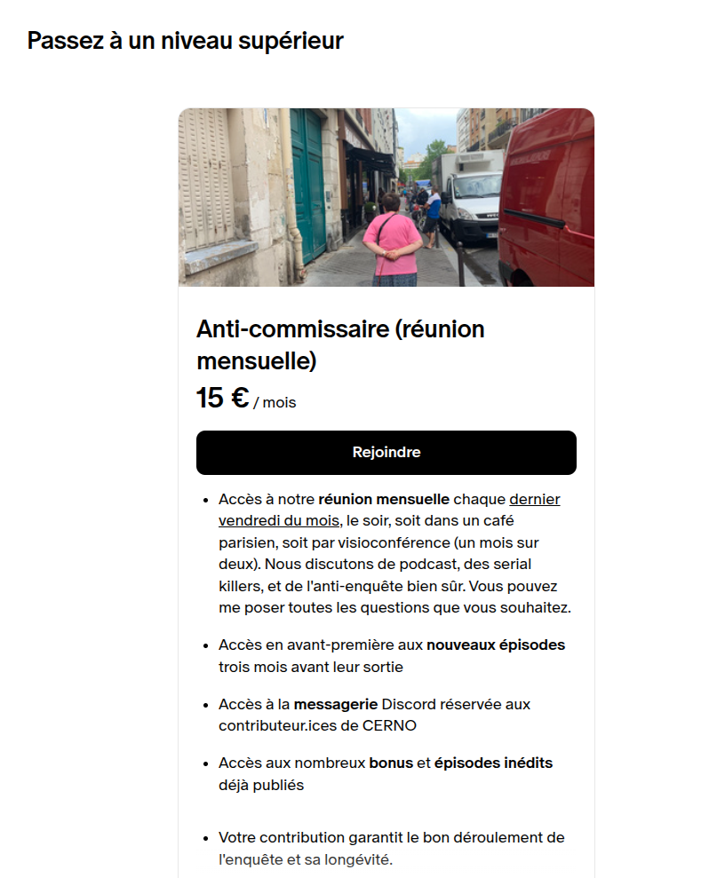<!-- .element: style="width:50%;float:right;margin-right:-1em;" -->

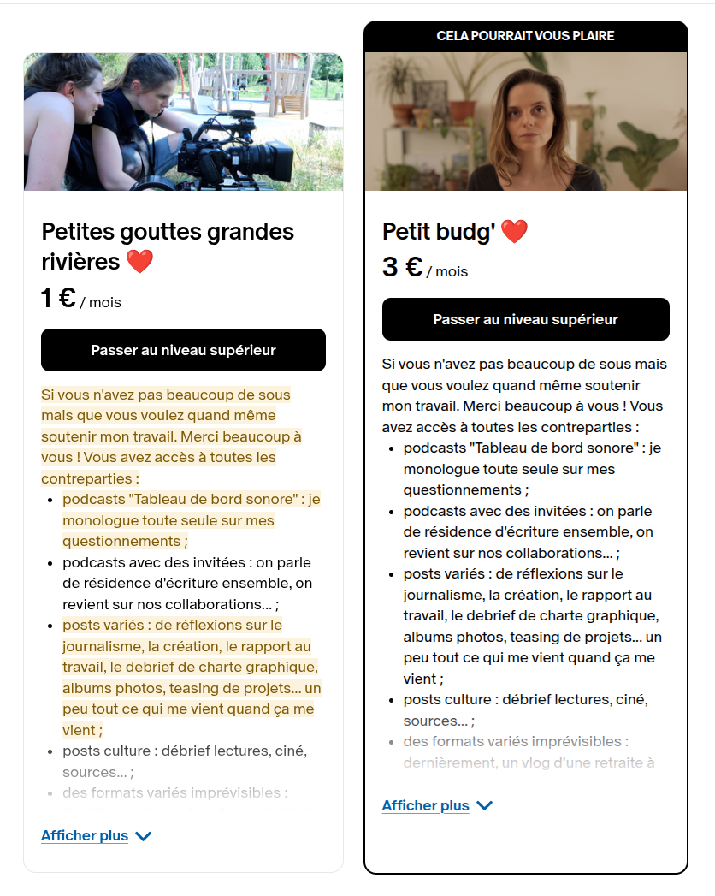<!-- .element: style="width:50%;float:left;margin-right:-1em;" -->

===

"Passez au niveau supérieur", c'est donc ce message que je rencontre très régulièrement sur Patreon, ou encore Substack, lorsque je décide de m'abonner au profil d'un auteur, d'un journaliste ou d'un créateur de contenu. J'emploie bien le terme d'abonnement, puisqu'il ne s'agit plus de "suivre" un contributeur comme j'en avais l'habitude sur les RSN traditionnels, mais bien de payer pour avoir un accès à des contenus "spéciaux" ou "supplémentaires".

§§§§§§§§§§§§§§§§§§§§§§§§§§§§§§§§§§§§§§§§§§§§§

<!-- .element: style="width:600px" -->

===

Ce passage au niveau supérieur a donc un coût, qui n'est pas négligeable. Quelques euros pour un abonnement, et la note peut vite monter lorsque l'on souhaite suivre plusieurs producteurs de contenus. Là où j'ai pu suivre des centaines de personnes sur certains réseaux, je ne peux pas me permettre ce même engagement sur Patreon, pour des raisons notamment financières. Mais qu'est-ce que cela veut dire exactement, passer au niveau supérieur ? De quel engagement parle-t-on, de la part de l'auteur comme du lecteur ? Dans ces nouveaux modèles éditoriaux, qui s'appuient sur de nouveaux modèles économiques, assiste-t-on à un déplacement de la valeur des contenus numériques ? Et, si déplacement il y a, en quoi celui-ci transforme-t-il certaines utopies de la culture numérique, en particulier celle de la culture du libre et du _peer to peer_, de la liberté d'expression et de l'auto-gouvernance -- des principes que l'on a pu retrouver dans un texte fondateur de la culture Web : *La Déclaration d'indépendance du cyberespace* de John Barlow ? Pour le dire encore autrement, et de manière un peu provocatrice, la culture numérique est-elle encore une culture populaire -- ou ne l'a-t-elle été que provisoirement et sur un malentendu ? 

§§§§§§§§§§§§§§§§§§§§§§§§§§§§§§§§§§§§§§§§§§§§§

### Contexte théorique & méthodologique :  étudier le Web à l'ère post-internet 

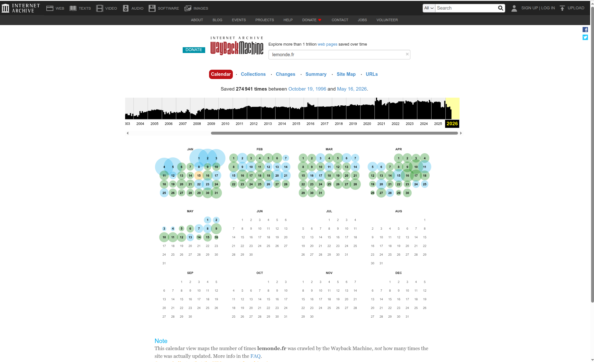<!-- .element: style="width:50%;float:left;margin-right:-1em;" -->

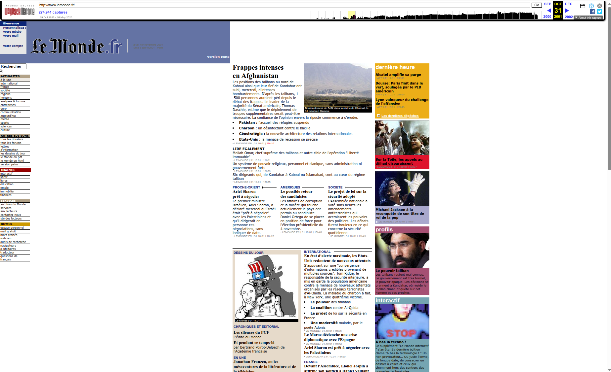<!-- .element: style="width:50%;float:right;margin-right:-1em;" -->

===

Après cette entrée en matière un peu directe, je vais me permettre d'ouvrir une parenthèse un peu longue, mais qui me semble très importante pour préciser ma problématique et mes arguments.

Je commencerai par situer mon propos dans un champ épistémologique qui n'est pas nécessairement connu de toutes et tous : le champ des _Web Studies_, un domaine assez récent en raison même de l'âge de l'objet qu'il présent étudier, le Web, inventé en 1990 par Tim Berners-Lee puis ouvert au "monde" en 1996. Les _Web studies_ proposent une approche interdisciplinaire du Web considéré comme une technologie, mais surtout comme un phénomène social, culturel, économique et politique. Dans le champ des _Web studies_, se développent depuis plusieurs années un travail d'analyse des _archives du Web_, qui ont été co-développées par des organisations à but non lucratif (WebArchive foundation que l'on connaît souvent via sa WayBack Machine), mais également par nos institutions patrimoniales (en France, BNF et INA). En d'autres termes, le Web est passé à l'histoire, et gagne à être étudié comme un objet historique, et plus seulement comme un phénomène contemporain. Ce passage à l'histoire est aussi marqué par notre entrée dans une ère parfois qualifiée de "post-internet". Catégorie un peu floue, le post-internet est à l'Internet ce que la post-modernité est à la modernité, c'est-à-dire qu'il désigne ce moment où les technologies de l'internet se sont sécularisées, invisibilisées sous l'effet de leur généralisation massive. 

§§§§§§§§§§§§§§§§§§§§§§§§§§§§§§§§§§§§§§§§§§§§§

>Le paradoxe des technologies et en particulier d’Internet, c’est que leur généralisation signe d’une certaine façon leur fin. C’est là une tension bien connue : quand une technologie est adoptée, elle disparaît dans son usage, sa singularité la distinguant d’autres modes d’existence semble se dissoudre d’elle-même.

>Internet n’est plus alors considéré comme une technologie, le moyen de certaines fins (artistiques par exemple), mais une part prépondérante de notre univers commun, un environnement pop tout comme les médias de masse constituèrent le populaire de la seconde partie du XXe.

<!-- .element: style="font-size:1.4rem; text-align:justify" -->

Grégory Chatonski, "Sans doute devons-nous abandonner l’idée que le commencement était habité par la fin", Billet de blogue, 5-2014

<!-- .element: style="font-size:1.4rem; text-align:right" -->

===

Grégory Chatonski synthétise parfaitement le concept : 

>Le paradoxe des technologies et en particulier d’Internet, c’est que leur généralisation signe d’une certaine façon leur fin. C’est là une tension bien connue : quand une technologie est adoptée, elle disparaît dans son usage, sa singularité la distinguant d’autres modes d’existence semble se dissoudre d’elle-même.

>Internet n’est plus alors considéré comme une technologie, le moyen de certaines fins (artistiques par exemple), mais une part prépondérante de notre univers commun, un environnement pop tout comme les médias de masse constituèrent le populaire de la seconde partie du XXe.

§§§§§§§§§§§§§§§§§§§§§§§§§§§§§§§§§§§§§§§§§§§§§

### Le Web comme _media_
* Des protocoles (http)...
* ... qui incarnent un projet épistémologique et philosophique
  * _peer to peer_
  * auto-gouvernance
  * utopie du collectif

===

En ce qui me concerne, je tends à considérer le Web comme un media, et je l'étudie avec les outils propres aux études médiatiques. Ce parti pris peut être sujet à discussion : en raison de sa nature plurimédiatique (il mélange texte, son, image, vidéo), le web est souvent considéré comme un support ou un espace de convergence d'autres médias, mais pas comme un média lui-même -- ou alors, comme un méta-média comme il m'est arrivé de le lire (à la suite des travaux de Manovitch, par exemple). Par ailleurs, le web est souvent confondu avec l'infrastructure qui le supporte, à savoir l'Internet, ainsi qu'avec l'ensemble des applications qui ont pourtant détourné les services parfois initialement conçus pour le web vers des interfaces et des espaces dédiés. C'est ce que l'on a appelé l'applification du Web : concrètement, depuis votre téléphone, vous avez davantage tendance à ouvrir Instagram sur l'appli Instagram, que de passer par un navigateur Web. Si j'apporte ces précisions terminologiques, ce n'est pas pour faire une leçon magistrale sur l'histoire de l'Internet et du Web, mais pour expliciter ma conception médiatique du Web. 

Tel que l'a pensé et conçu Tim Berners-Lee, le Web est d'abord défini par des protocoles, en particulier le protocole http, qui au-delà du jargon technique, est en fait porteur d'une utopie du partage et de la relation, qui sera incarnée par une hypertextualité radicale. Le Web de TBL, ce n'est pas qu'un outil, c'est un projet épistémologique et philosophique où le partage des informations de _pair à pair_ est absolument essentiel. C'est pourquoi TBL avait conçu le Web comme un outil gratuit dont les protocoles et les langages sont définis et maintenus par la communauté (W3C). Les conséquences de cette utopie, en termes notamment de production, de circulation et de légitimation des informations, sont au fondement de notre culture numérique du tournant du XXIe siècle. Je dirais même qu'elles ont structuré ou restructuré notre culture populaire contemporaine -- culture dont le web a joué un rôle de diffuseur, mais également de modèle conceptuel. 

§§§§§§§§§§§§§§§§§§§§§§§§§§§§§§§§§§§§§§§§§§§§§

### Emmerdification

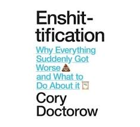<!-- .element: style="width:40%;float:right;margin-right:-1em;" -->

Applification
Plateformisation
Algorithmisation
Monétisation des données

<!-- .element: style="width:40%;float:left;font-size:3rem; text-align:right" -->

===

L'applification du Web, et plus généralement sa plateformisation, ont introduit peu à peu une logique économique qui a dévoyé le projet initial de TBL. En déployant des services qui nous ont d'ailleurs enfermés dans des écosystèmes (par exemple, l'écosystème de Google), les GAFAM ont trouvé un intarissable filon à monétiser : nos données, en particulier nos données personnelles, qui ont été privatisées par les grandes entreprises. Derrière nos données, c'est notamment notre attention, mais également notre manque de culture technique ou de littératie numérique, qui fait la fortune de ces groupes.

§§§§§§§§§§§§§§§§§§§§§§§§§§§§§§§§§§§§§§§§§§§§§

## _Dead Internet theory_ : la fin des utopies ?

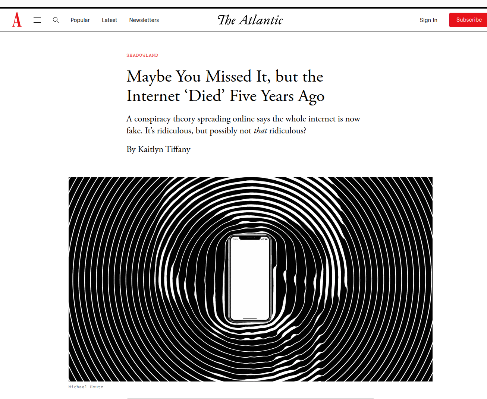<!-- .element: style="width:40%;float:left;margin-right:-1em;" -->

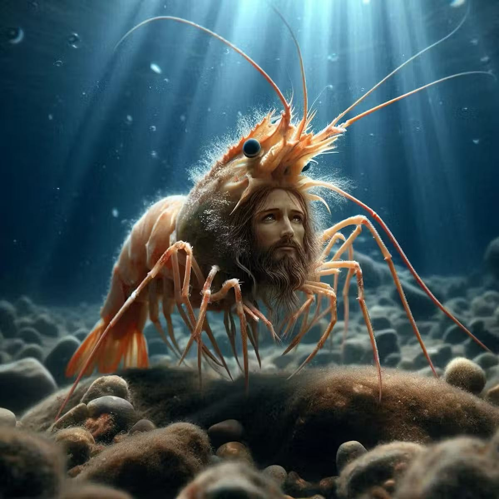<!-- .element: style="width:60%;float:right;margin-right:-1em;" -->

===

Dans ce contexte post-internet, le Web est traversé par un imaginaire de la fin, que vous avez peut-être vu passer sous l'expression de la "Dead Internet Theory". Cette théorie de l'internet mort est déjà en vogue depuis pas mal d'années, on situe sa naissance vers 2016, et elle ne fait pas l'objet d'un concensus (pour certain.es elle relèverait même d'une théorie du complot). Elle s'appuie sur un constat que l'on a toutes et tous eu l'occasion de réaliser : des éléments techniques, tels que l'algorithmisation du Web, la croissance des réseaux sociaux, et tout récemment le développement exponentiel des IAG grand public, ont eu tendance à uniformiser l'espace numérique, provoquant une nouvelle concentration éditoriale sous l'emprise des GAFAM. Cette théorie a ses concepts dérivés : le Web Zombie, le Slop, l'emmerdification (Doctorrow), le technofascisme, le vectofascisme. Comme toutes les théories, elle a aussi ses contre-théories ou ses théories et pratiques alternatives : Alive Web, Indie Web, le fédiverse, etc. 

§§§§§§§§§§§§§§§§§§§§§§§§§§§§§§§§§§§§§§§§§§§§§

De quoi ce discours de la fin marque-t-il la fin,   ou même le début ?

===

Depuis quelques mois, je m'intéresse beaucoup à ces discours de la fin ou du renouveau du Web, discours parfois très différents et contradictoires, qui donnent lieu à une série de réactions de la part des créateurs de contenus, et notamment des journalistes et des écrivains, sous la forme de production _alternatives_, mais également sous la forme de débats à la fois théoriques, technocritiques, politiques voire esthétiques assez passionnants. Comme si la "fin" annoncée du Web marquait le renouveau d'une pensée et d'une pratique des écritures numériques. Mais alors de quoi ce discours de la fin marque-t-il la fin, ou même le début ? Pour résumer à gros traits mon intuition, je dirais que ce discours est surtout symptomatique de la fin d'une utopie du collectif et de l'auto-gouvernance propre à la création de l'Internet, puis du Web. Cette fin de l'utopie du collectif entraîne la crise de certains concepts qui lui étaient associés, en particulier, la culture de la participation, ou l'"impératif participatif" comme l'a proposé Marta Severo. L'impératif participatif ne renvoie pas à une injonction à participer, mais à l'idée selon laquelle la légitimation d'un contenu numérique passerait nécessairement par le biais d'une ouverture à la participation, à la réappropriation, bref à l'éditorialisation. 

Il y aurait plein d'angles à travailler à partir de là, mais dans le cadre de la thématique de ce colloque, le fil que je souhaiterais tirer est celui de ce discours et contre-discours de l'indépendance des créateurs de contenus et journalistes (je sais que je mélange deux termes, mais je vais vous expliquer pourquoi dans un instant). Une indépendance qui se pense à plusieurs plans : liberté éditoriale, mais également formelle. Dans mes recherches, encore très préliminaires, j'ai identifié 3 grandes catégories d'alternatives travaillées par les producteurs de contenus : 
- le retour à l'épistolarité numérique : la newletter
- le retour à des formes de publication du premier Web (IndieWeb, Web statique)
- des plateformes "anti-plateformisation" : substack, ou encore Patreon, qui est la plateforme dont je vais parler aujourd'hui. 

§§§§§§§§§§§§§§§§§§§§§§§§§§§§§§§§§§§§§§§§§§§§§

## Patreon, le réseau anti réseau social

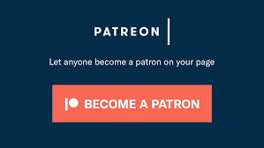

===

Créée en 2013 aux États-Unis, Patreon a d’abord été conçue pour soutenir les musiciens professionnels, mais elle a rapidement séduit de nombreuses communautés d’artistes actifs en ligne, mais également des journalistes ou des documentaristes qui y ont déployé un projet journalistique, voire un média, un journal à part entière. 

Comme le suggère son nom — Patreon est une déformation du terme anglais patron, qui signifie donateur, mécène —, elle appartient à la grande famille des plateformes de financement participatif, dont elle incarne un modèle assez mal connu : contrairement aux plateformes de crowdfunding traditionnelles où l’usager est invité à financer des projets ponctuels en échange de contreparties matérielles (Ulule, Kickstarter), Patreon opte pour un modèle de microcontributions mensuelles permettant aux artistes de s’assurer une rémunération régulière, sur le modèle du salaire. Elle défend ainsi le principe d’une relation à long terme entre le créateur et son public selon une logique de mécénat qui ne fixe aucune durée de collecte ni d’objectifs de production finaux comme la publication d’un livre, par exemple. Les contreparties, sur Patreon, se caractérisent par un accès privilégié à des contenus exclusifs, ou encore à un canal de communication direct avec le producteur de contenus en personne. Les formules d’abonnement sont déterminées en fonction du niveau d'accès aux contenus, mais également au producteur de contenus lui-même. 

Comparée aux grandes plateformes sociales et culturelles, Patreon apparaît presque comme un média « de niche », qui mobilise un public averti : elle comptait 8 millions d’usagers en 2024 à travers le monde, là où Facebook en dénombre presque 3 milliards, TikTok 2 milliards, et où Wattpad, plateforme entièrement dédiée à l’écriture, enregistre 90 millions de connexions chaque mois. « Confidentielle » à l’échelle des communautés numériques, Patreon n’a d’ailleurs pas encore généré une importante littérature scientifique, et les quelques travaux qui lui sont consacrés s’intéressent essentiellement au business model de la plateforme.

§§§§§§§§§§§§§§§§§§§§§§§§§§§§§§§§§§§§§§§§§§§§§

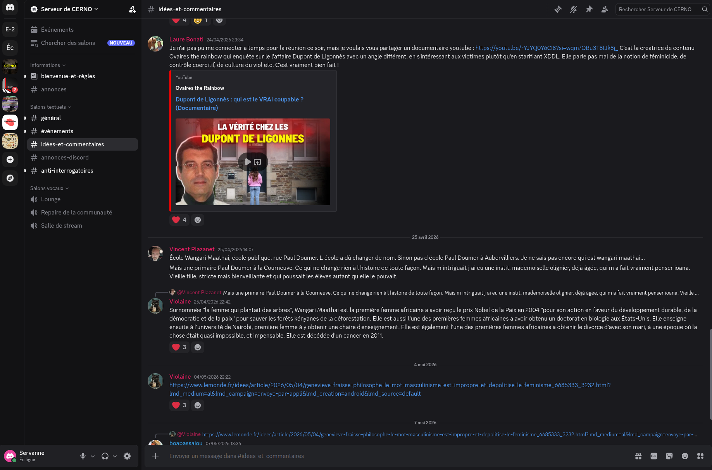

Source : Canal discord de Cerno

<!--.element class="source"-->

===

Patreon mise en effet sur une sociabilité plus authentique que sur les autres réseaux, en garantissant notamment un accès « direct » au créateur. Plusieurs espaces et protocoles d’échanges sont déployés sur la plateforme : outre les traditionnels espaces de commentaires sous les publications, Patreon offre la possibilité de rajouter une brique logicielle de chat (discord ou slack) qui favorise des discussions au sein de la communauté.

§§§§§§§§§§§§§§§§§§§§§§§§§§§§§§§§§§§§§§§§§§§§§

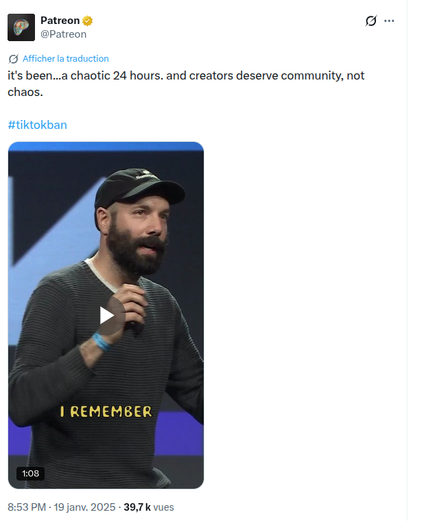<!-- .element: style="width:50%;float:left;margin-right:-1em;" -->

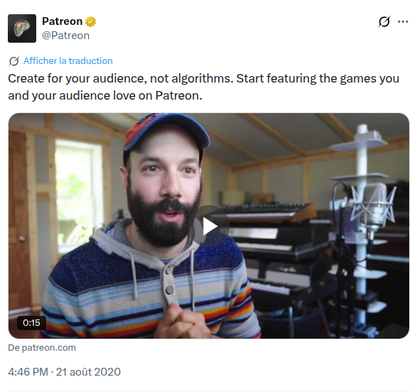<!-- .element: style="width:50%;float:right;margin-right:-1em;" -->

Source : Compte X de @Patreon

<!--.element class="source"-->

===

Non sans ironie, c’est sur le réseau social X que les concepteurs de la plateforme ont publicisé cette sociabilité fondée à la fois sur l’expertise de l’audience et sur une approche anti-algorithmique, rejouant ainsi l’opposition entre une les paradigmes qualitatifs et quantitatifs (incarnés par Youtube, ou encore, dans le second tweet cité, TikTok) :

>Create for your audience, not algorithms.
>Creators deserve community, not chaos. #tiktokban

Ces choix détonnent au regard des enjeux de participation des publics qui, dans notre économie de l’attention contemporaine, constituent le levier essentiel de la captation durable de l’audience. Tout l’intérêt des plateformes réside justement dans leur capacité à structurer les interactions avec le public, grâce aux fonctionnalités conversationnelles de l’interface, combinées à une gestion des contenus et des communautés optimisées par les algorithmes de recommandation et de popularité en analysant les fameuses données des utilisateurs. 

§§§§§§§§§§§§§§§§§§§§§§§§§§§§§§§§§§§§§§§§§§§§§

Le modèle de Jack Conte

* Moins de traitements algorithmiques
* Valorisation du "true fan"/"true follow"
* Retour à des micro-communautés
* Philosophie du Web 1.0

===

En résumé, la plateformisation croissante provoque une régulation de la participation, dévoyée à des fins commerciales — c’était d’ailleurs là l’objectif annoncé dès 2005 par Tim O’Reilly, pionnier de l’édition numérique et grand promoteur du Web 2.0. Bien qu’émanant des grandes utopies du web qui prônaient l’horizontalisation des échanges et l’autogouvernance, la culture participative tendrait ainsi de plus en plus vers une logique du capital. Jack Conte, le co-fondateur de Patreon, assure ainsi la promotion de sa plateforme en dénonçant les dérives du management algorithmique propres aux grands médias et réseaux sociaux. Il oppose à l’économie du clic les concepts de « true follow » ou encore de « true fans ». Son discours, dont on peut entendre de larges extraits dans des conférences de type Ted Talk rediffusés sur Youtube, s’inscrit dans une réflexion historique sur la participation et les sociabilités numériques depuis l’invention du web. Il défend notamment le retour à des microcommunautés (des communautés sélectionnées sur l’expertise et l’engagement, notamment financier, qu’elles sont prêtes à prendre pour un artiste) en s’appuyant sur une nostalgie de plus en plus grande à l’égard du web 1.0 qui vient servir un certain discours de l'authenticité.

§§§§§§§§§§§§§§§§§§§§§§§§§§§§§§§§§§§§§§§§§§§§§

## Corpus et méthodologie : bricolage et braconnage
* Cerno
* Tal Madesta
* Marine Périn
* Korben

===

J'ai voulu prendre la mesure de ce discours auprès d'un petit corpus de 4 auteurs, qui me permettent de représenter une diversité de genres documentaires, et qui embrassent des réalités très différentes du journalisme et du statut journalistique : 

§§§§§§§§§§§§§§§§§§§§§§§§§§§§§§§§§§§§§§§§§§§§§

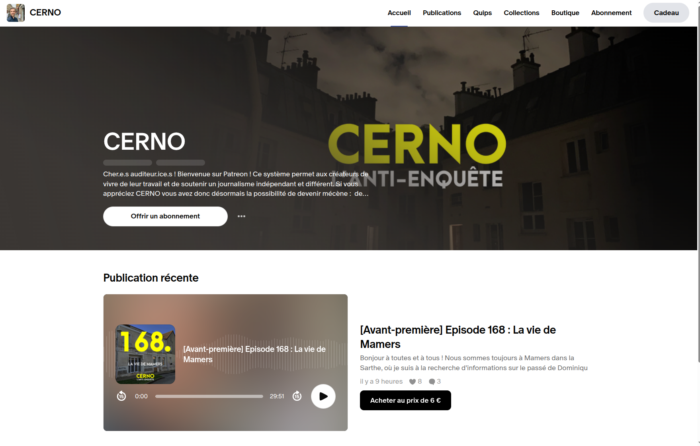

===

CERNO (ou Julien Cernobori) est en quelque sorte la star de ce corpus. Il s'agit d'un journaliste expérimenté, qui a travaillé pour Radio France et Binge Audio. Sur Patreon, CERNO publie plusieurs séries de podcast depuis 2020, mais la série pour laquelle on le connaît le plus est "L'anti-enquête", qui a fait été beaucoup médiatisée, et qui revient sur l'Affaire du tueur de vieilles dames Thierry Paulin (condamné pour 19 féminicides) et de son complice Jean-Thierry Mathurin. Le mode d'expression de CERNO est principalement le podcast, même si certains posts sont accompagnés de courts textes rédigés. À première vue, on pourrait prendre le travail de CERNO pour du "true crime" ou de l'enquête policière, mais comme l'a très bien expliqué Fanny Dujardin qui a rédigé une thèse sur les récits sonores : "le projet s’inscrit ainsi dans une visée éthique réparatrice, dirigée vers des disparues anonymes auxquelles il s’agit de redonner une épaisseur identitaire." En d'autres termes, CERNO s'intéresse davantage aux portraits des victimes qu'à celui des tueurs, et on verra que cela a toute son importance. 

§§§§§§§§§§§§§§§§§§§§§§§§§§§§§§§§§§§§§§§§§§§§§

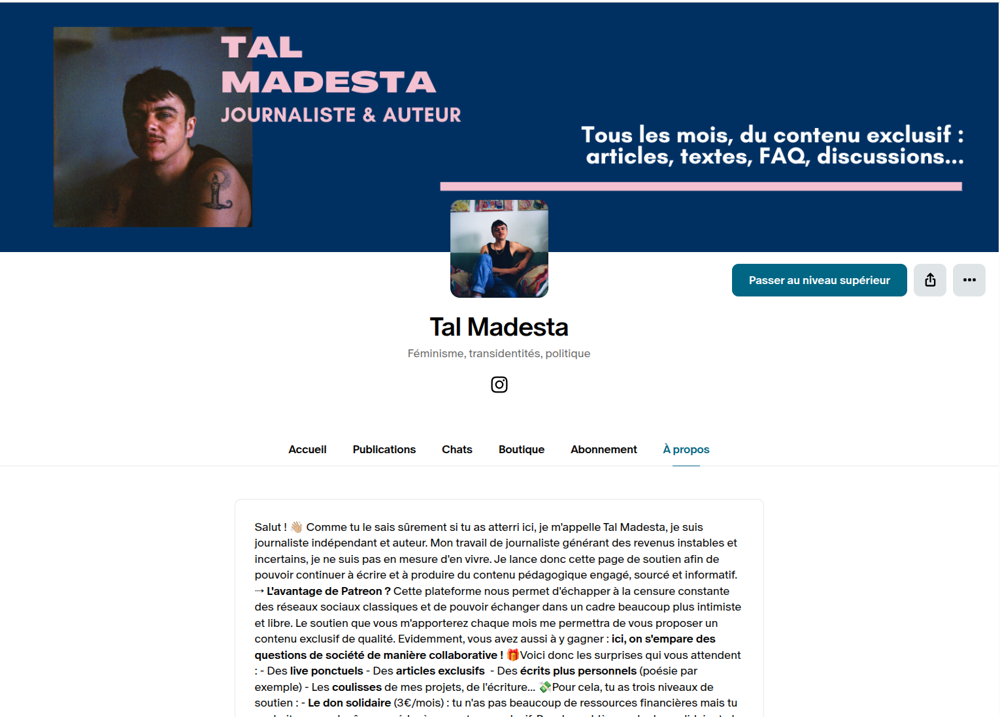

===

Tal Madesta est un journaliste indépendant et essayiste, d'une génération plus jeune (né en 1993). Il a collaboré avec *La Déferlante*, et il a par ailleurs publié plusieurs essais sur le féminisme et l'expérience transgenre. Sur son profil Patreon, ouvert en 2022, Tal Madesta publie plutôt des contenus textuels, avec ponctuellement du podcast ou de la vidéo. On y retrouve des textes personnels, de la poésie, des compte-rendus d'ouvrages, des analyses de l'actualité... autour d'une thématique récurrente : la transidentité et le féminisme.

§§§§§§§§§§§§§§§§§§§§§§§§§§§§§§§§§§§§§§§§§§§§§

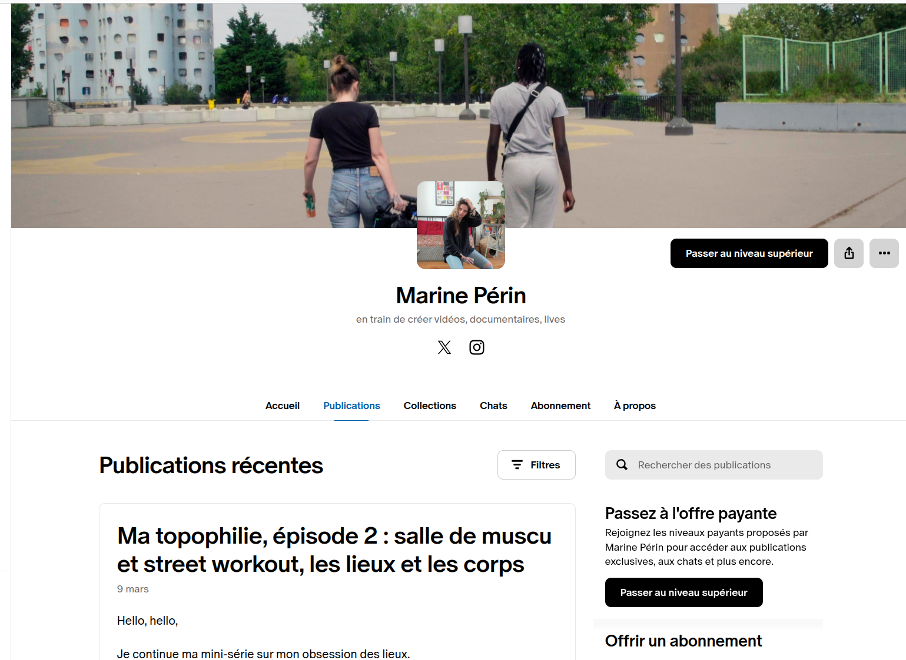

===

Marine Périn est vidéaste, réalisatrice et journaliste francophone, spécialisée dans la presse féministe. Elle s'est faite connaître grâce aux RSN et en particulier à sa chaîne YouTube sous le nom de Marinette. En 2020, elle a remporté le prix EllesFontYouTube pour son documentaire *Traquées*. Depuis quelques années, Marine Périn a progressivement déserté les réseaux pour se consacrer à des projets portés par des médias plus institutionnels. Elle ne publie plus que sur son Patréon depuis à peu près 2 ans. Son espace Patreon lui sert principalement à parler de journalisme, c'est-à-dire de la fabrique de l'information. 

§§§§§§§§§§§§§§§§§§§§§§§§§§§§§§§§§§§§§§§§§§§§§

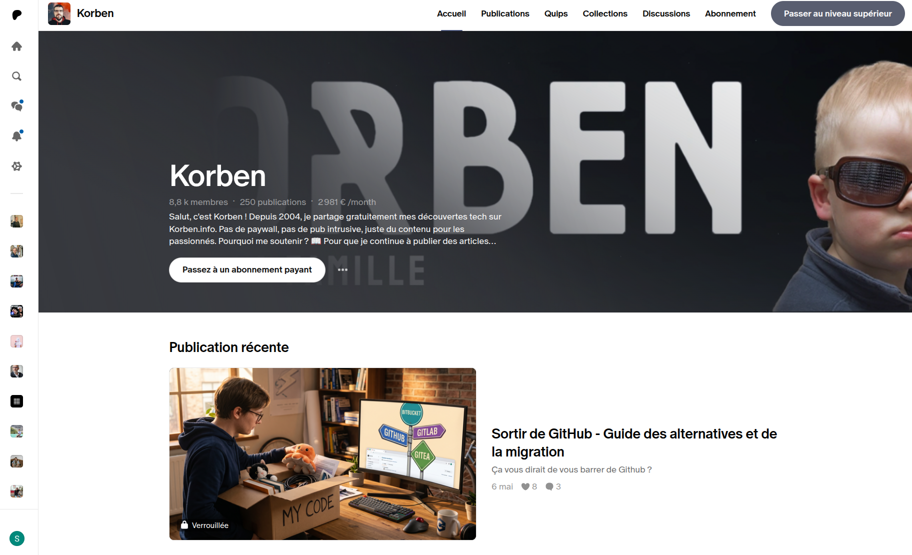

===

Korben (pseudo de Manuel Dorne) n'est pas journaliste de formation, mais il s'est fait un nom dans le champ des médias spécialisés en informatique, à l'époque où on parlait encore de "blogueurs". Si je l'ai inclu dans mon corpus, c'est parce que je trouve son discours sur la technique en écho avec la longue introduction consacrée à la culture web, selon un angle particulièrement technique. Sur son Patreon, on va donc trouver des tutos pour faire fonctionner une IAG en local.

§§§§§§§§§§§§§§§§§§§§§§§§§§§§§§§§§§§§§§§§§§§§§

### Difficultés et limites méthodologiques
* Approche circonscrite à une sémiotique des plateformes
* Cherchabilité limitée
* Périmètre discutable

===

Ce corpus est arbitraire, j'aurais aimé réaliser une approche plus systématique. Le temps m'a manqué, mais pas que. Travailler sur Patreon n'est pas si simple, on rencontre de nombreuses difficultés méthodologiques : 
- d'abord, on reste sur un service plateformisé, avec un accès aux données très limité. Ce que je montre là relève donc uniquement de la sémiotique des plateformes, ce qui m'oblige à ne réaliser qu'une analyse de surface : pas d'accès au back office, pas d'accès non plus au paramétrage, pas d'API me permettant d'extraire des métadonnées. Ce que je montre est d'ailleurs pour partie du contenu privé, accessible via mon abonnement.
- c'est d'ailleurs le second problème : on est sur des contenus payants (à titre perso, je n'ai pas payé une quantité d'abonnements, donc certains sont mieux explorés que d'autres, pour lesquels je suis restée à la couche "publique")
- de manière générale, j'ai éprouvé de vraies difficultés à établir mon périmètre et à identifier des cas d'étude. Le moteur de recherche de Patreon est assez inefficace, et il n'y a pas de section "Journalisme" dans lequel seraient indexés tous les profils dédiés. Pour être transparente, j'ai surtout fonctionné par recommandation interne à des profils Patreon que je suivais déjà, ou alors de bouche à oreille. 
- ainsi, et c'est la dernière difficulté, je me suis souvent heurtée à des questions de pertinence et de nature des contenus : qu'est-ce que relève de l'écriture journalistique ou pas ? Qui est "officiellement" journaliste, ou pas ? J'ai fini par embrasser ma contrainte, puisqu'elle me semble significative de ces objets et d'une redistribution de l'autorité et des compétences propre à la culture numérique. 

§§§§§§§§§§§§§§§§§§§§§§§§§§§§§§§§§§§§§§§§§§§§§

### Le discours de l'indépendance
* Indépendance médiatique et éditoriale
* Indépendance formelle
* Indépendance financière

===

Quand on passe un peu de temps sur les Patreon de ces quatre auteurs, la question de l'indépendance journalistique apparaît comme un élément essentiel du discours auctorial. J'ai identifié trois grandes thématiques distinctes qui sont directement abordées et étroitement reliés : l'indépendance médiatique et éditoriale d'une part, l'indépendance formelle/esthétique d'autre part, et enfin l'indépendance financière. Je vais rapidement les passer en revue, puis je conclurai.

§§§§§§§§§§§§§§§§§§§§§§§§§§§§§§§§§§§§§§§§§§§§§

### [1] L'indépendance médiatique et éditoriale : un discours technocritique qui tend à se politiser

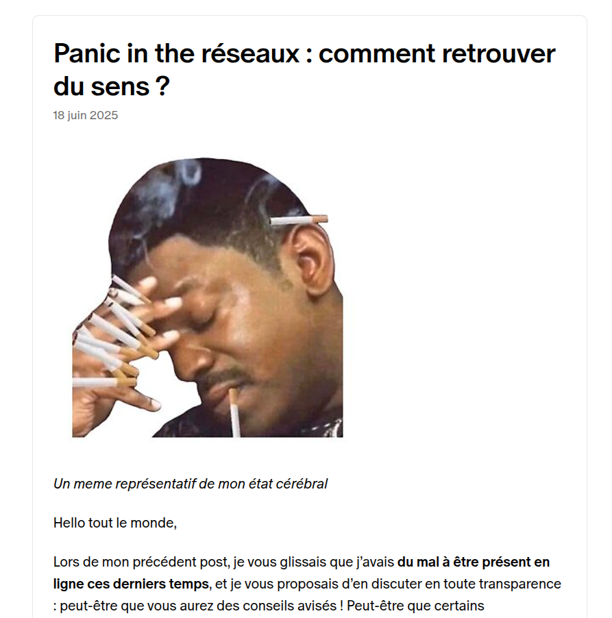<!-- .element: style="width:400px" -->

===

Dans l'immense majorité des cas que j'ai rencontrés, les auteurs qui publient sur Patreon utilisent l'espace de description profilaire pour justifier voire pour revendiquer leur usage de la plateforme -- et c'est le cas pour ce petit corpus. Le choix éditorial de la plateforme Patrein est étroitement articulé à des préocuppations d'indépendance, qui passe par des positions technocritiques plus ou moins affirmées et politisées. Cette justification, on la retrouve sur la plupart des réseaux du fédiverse, sur Mastodon par exemple.

§§§§§§§§§§§§§§§§§§§§§§§§§§§§§§§§§§§§§§§§§§§§§

>C'est simple : votre soutien = ma liberté éditoriale
>Rejoignez les 400+ personnes qui croient en un web indépendant !

<!-- .element: style="font-size:1.4rem; text-align:justify" -->

>Korben

<!-- .element: style="font-size:1.4rem; text-align:right" -->

>Ce système permet aux créateurs de vivre de leur travail et de soutenir un journalisme indépendant et différent.

<!-- .element: style="font-size:1.4rem; text-align:justify" -->

>Cerno

<!-- .element: style="font-size:1.4rem; text-align:right" -->

===

Ainsi chez Korben : 
>C'est simple : votre soutien = ma liberté éditoriale
>Rejoignez les 400+ personnes qui croient en un web indépendant !

Chez CERNO : 
>Ce système permet aux créateurs de vivre de leur travail et de soutenir un journalisme indépendant et différent.

§§§§§§§§§§§§§§§§§§§§§§§§§§§§§§§§§§§§§§§§§§§§§

>C’est très frustrant de dépendre d’une certaine régularité et des algorithmes pour créer. 

<!-- .element: style="font-size:1.4rem; text-align:justify" -->

>Marine Périn

<!-- .element: style="font-size:1.4rem; text-align:right" -->

>Cette plateforme nous permet d'échapper à la censure constante des réseaux sociaux classiques et de pouvoir échanger dans un cadre beaucoup plus intimiste et libre. Le soutien que vous m'apporterez chaque mois me permettra de vous proposer un contenu exclusif de qualité. Evidemment, vous avez aussi à y gagner : ici, on s'empare des questions de société de manière collaborative !

<!-- .element: style="font-size:1.4rem; text-align:justify" -->

>Tal Madesta

<!-- .element: style="font-size:1.4rem; text-align:right" -->

===

Chez certains auteurs, cette indépendance médiatique et éditoriale se supperpose à un discours technocritique plus articulé, avec des arguments anti-plateforme ou anti-algorithme, comme chez Marine Périn : 

>C’est très frustrant de dépendre d’une certaine régularité et des algorithmes pour créer. 

Ou encore Tal Madesta :
>Cette plateforme nous permet d'échapper à la censure constante des réseaux sociaux classiques et de pouvoir échanger dans un cadre beaucoup plus intimiste et libre. Le soutien que vous m'apporterez chaque mois me permettra de vous proposer un contenu exclusif de qualité. Evidemment, vous avez aussi à y gagner : ici, on s'empare des questions de société de manière collaborative !

C'est chez Tal Madesta sans doute que le discours d'adhésion à Patreon est le plus politisé, avec l'idée d'échapper à la censure. Tal Madesta a par ailleurs produit des posts qui attaquent les autres réseaux, en particulier Twitter/X. 
 
Ce qui est intéressant, c'est que chacun des profils que j'ai sélectionnés explicite son choix du media de publication Patreon et le présente comme la condition de possibilité de toutes les autres formes d'indépendance : éditoriale, économique, etc. Ces discours me semblent, à leur façon, reprendre des positions anti-GAFAM de manière plus ou moins consciente et explicite, en établissant une corrélation entre l'indépendance technologique, les alternatives éditoriales, et les contenus indépendants ou eux-mêmes alternatifs. Ce discours passe aussi par un recours assumé à des réseaux fermés voire payants, ce qui était inimaginable il y a encore 10 ans. 

§§§§§§§§§§§§§§§§§§§§§§§§§§§§§§§§§§§§§§§§§§§§§

### [2] L'indépendance formelle et esthétique : éloge des longs formats

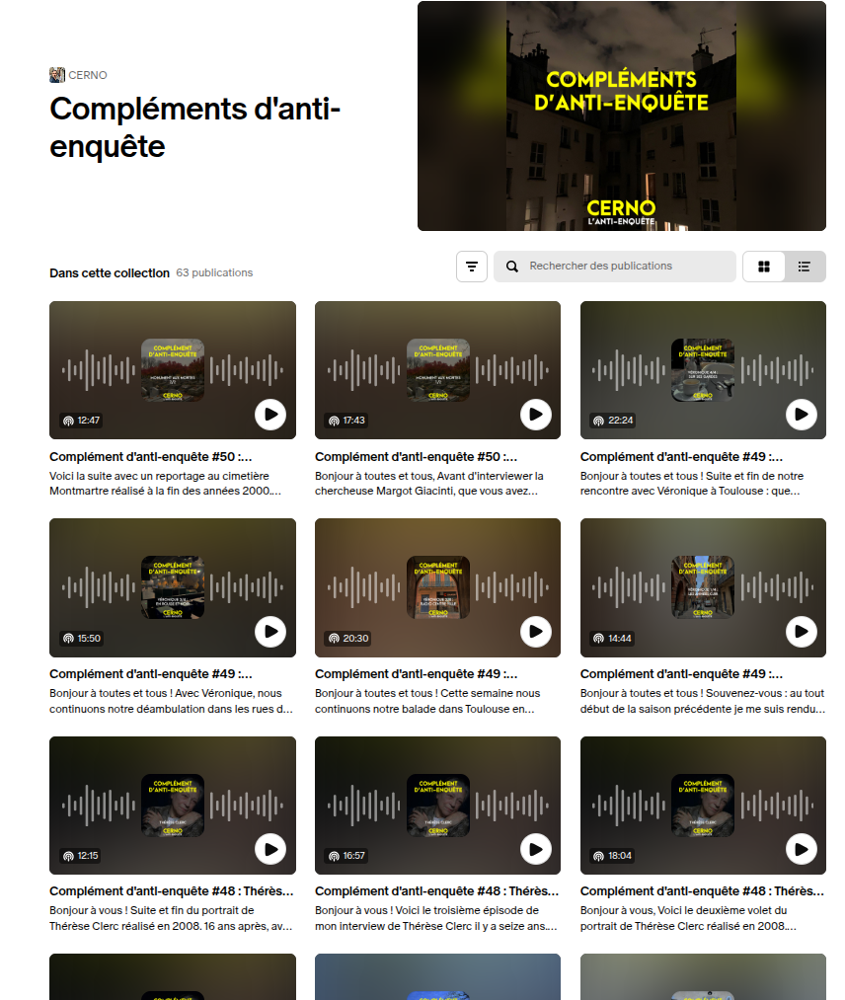<!-- .element: style="width:400px" -->

===

Une seconde revendication d'indépendance renvoie aux formes d'écritures journalistiques, qui tendent vers des formats "alternatifs", podcasts, vidéos, ayant en commun de jouer sur le temps long. Quand je parle de temps long, cela concerne :
- le format de ce qui est publié (des podcast ou vidéos de 20 à 30 minutes par exemple)
- le rythme de publication qui favorise des effets "feuilleton" pouvant s'étaler sur des années, comme chez CERNO qui mène depuis 8 ans l'enquête sur l'affaire Paulin.
- mais également la revendication d'un droit à l'écriture plus long (et c'est en cela peut-être qu'on retrouve ici une certaine idée du *slow journalism*)

§§§§§§§§§§§§§§§§§§§§§§§§§§§§§§§§§§§§§§§§§§§§§

>Cette anti-enquête durera le temps qu’elle doit durer et je me laisserai, comme à mon habitude, guider par les rencontres imprévues.

<!-- .element: style="font-size:1.4rem; text-align:justify" -->

>Cerno

<!-- .element: style="font-size:1.4rem; text-align:right" -->

>Plus le temps passe, et plus les projets grossissent - et ça c’est très cool. Le revers de la médaille, c’est que ma présence se raréfie sur les réseaux… alors que je fais plein de choses ! 
>Qui peut sortir un documentaire par mois ? C’est la première raison pour laquelle je lance cette page.

<!-- .element: style="font-size:1.4rem; text-align:justify" -->

>Marine Périn

<!-- .element: style="font-size:1.4rem; text-align:right" -->

===

Chez CERNO par exemple : 
>Cette anti-enquête durera le temps qu’elle doit durer et je me laisserai, comme à mon habitude, guider par les rencontres imprévues.

Pour Marine Périn, Patreon est un moyen de rester sur un réseau sans être soumise à l'injonction de publication des RSN traditionnels, où la visibilité est conditionnelle à l'occupation de l'espace médiatique : 
>Plus le temps passe, et plus les projets grossissent - et ça c’est très cool. Le revers de la médaille, c’est que ma présence se raréfie sur les réseaux… alors que je fais plein de choses ! 
>Qui peut sortir un documentaire par mois ? C’est la première raison pour laquelle je lance cette page.

Korben, de son côté, fait du Patreon une réserve de contenus exclusifs payants permettant de financer un site Web aux contenus publics, "sans publicité agressive". C'est également un peu le même sens que Tal Madesta apporte à son Patréon, qu'il présente également comme "une page de soutien".

§§§§§§§§§§§§§§§§§§§§§§§§§§§§§§§§§§§§§§§§§§§§§

>[J]’aime l’idée de m’entourer d’une communauté rapprochée pour discuter des rouages de mon travail. Pour des raisons politiques et éthiques, j’ai envie que mes contenus journalistiques restent publics et gratuits. [...] Je trouve souvent le procédé de création aussi intéressant que le résultat et c’est ce que je vous propose de retrouver ici : posts, podcasts, vidéos autour de mon travail, de mon militantisme, de ce que vous voyez et ne voyez pas, et de comment tout ça s’entremêle.

<!-- .element: style="font-size:1.4rem; text-align:justify" -->

>Marine Périn

<!-- .element: style="font-size:1.4rem; text-align:right" -->

===

L'approche de Marine Périn est de ce point de vue assez intéressante : 
> j’aime l’idée de m’entourer d’une communauté rapprochée pour discuter des rouages de mon travail. Pour des raisons politiques et éthiques, j’ai envie que mes contenus journalistiques restent publics et gratuits. [...] Je trouve souvent le procédé de création aussi intéressant que le résultat et c’est ce que je vous propose de retrouver ici : posts, podcasts, vidéos autour de mon travail, de mon militantisme, de ce que vous voyez et ne voyez pas, et de comment tout ça s’entremêle.

Son Patreon est donc moins un espace médiatique que méta-médiatique, c'est-à-dire un espace de discussion autour de son travail, un lieu de publication des "making of".

Patreon, de ce point de vue, me semble inverser une tendance des RSN qui jouaient un rôle de "vitrine" pour les créateurs de contenus, afin de générer d'autres formes de rémunération, parfois délocalisées. Sur Patreon, il faut finalement déjà bien connaître l'activité du créateur dans d'autres espaces avant de s'engager sur la plateforme. J'y reviendrai car cela a des implications pour les lecteurs.

§§§§§§§§§§§§§§§§§§§§§§§§§§§§§§§§§§§§§§§§§§§§§

### [3] L'indépendance financière : la valeur du travail journalistique en question

<!-- .element: style="width:400px" -->

===

La formule est-elle nécessairement gagnante ? Il faudrait interroger directement chaque contributeur pour le savoir. Le seul avec lequel j'en ai parlé directement, c'est Julien Cernobori, pour qui Patreon est un réel coup de pouce, mais ne permet pas non plus de dégager un important salaire alors même que cette activité lui demande énormément de temps. 

§§§§§§§§§§§§§§§§§§§§§§§§§§§§§§§§§§§§§§§§§§§§§

| Créateur.ice | Revenus mensuels | Abonnés payants/total abonnés|
|--------------|------------------|------------------------------|
| Tal Madesta  |        359,1 €   | 86/434 |
| CERNO        |  Non disponible  |    1k/3,2k     |
| Korben       |  2 901 €         |   1,2 k/8,5k      |
| Marine Perrin|     115,6 €      |     39/213     |

===

Sur chaque profil Patreon figurent des informations au sujet de l'audience, voire des revenus générés :

| Créateur.ice | Revenus mensuels | Abonnés payants/total abonnés|
|--------------|------------------|------------------------------|
| Tal Madesta  |        359,1 €   | 86/434 |
| CERNO        |  Non disponible  |    1k/3,2k     |
| Korben       |  2 901 €         |   1,2 k/8,5k      |
| Marine Perrin|     115,6 €      |     39/213     |

Je n'ai pas eu le temps de creuser cette piste, mais il me semble qu'il se joue ici c'est aussi une nouvelle condition du pigiste. 

L'un des principaux intérêts de Patreon, c'est qu'il met au centre du problème la "Valeur travail" du journaliste, dans un contexte où nous avons un peu perdu l'habitude de payer pour accéder à l'information.

§§§§§§§§§§§§§§§§§§§§§§§§§§§§§§§§§§§§§§§§§§§§§

#### Tal Madesta, Marine Perin : plusieurs niveaux de contribution pour un accès identique

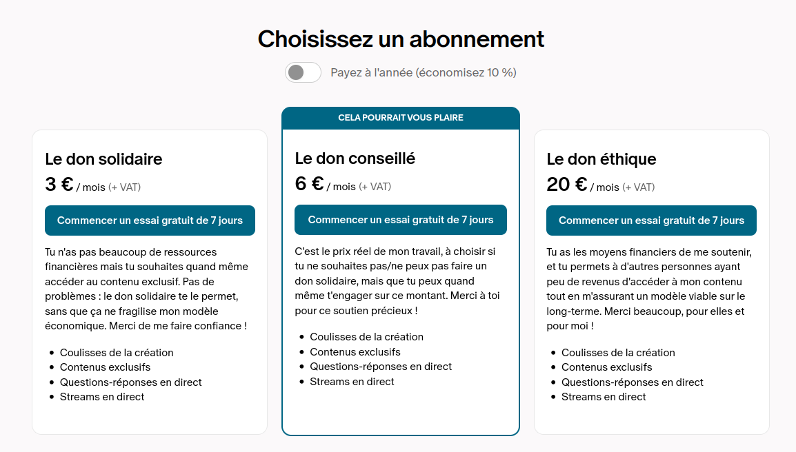<!-- .element: style="width:500px" -->

>**Tous ces niveaux donnent accès au même contenu : je ne souhaite pas que les revenus de chacun-e conditionnent l'accès à ce que je propose. Ce système fonctionne sur la confiance : c'est à toi de réfléchir sur ce que tu es en mesure (ou non) de donner pour le travail que je produirai spécifiquement ici.**

<!-- .element: style="font-size:1.4rem; text-align:justify" -->

Tal Madesta

<!-- .element: style="font-size:1.4rem; text-align:right" -->

===

Comme j'ai pu le dire, sur Patreon il y plusieurs paliers d'abonnements, qui généralement donnent accès à différents types de contenus. 

Chez la plupart des journalistes, et notamment Tal Madesta ou Marine Périn, cette logique du palier a été renversée pour en revenir à la question de cette valeur travail : les contenus sont donc tous accessibles quel que soit le "niveau de contribution", et il revient au lecteur de choisir le niveau qui lui correspond le mieux, en fonction de sa situation économique.  

>Le don solidaire (3 € / mois) : Tu n'as pas beaucoup de ressources financières mais tu souhaites quand même accéder au contenu exclusif. Pas de problèmes : le don solidaire te le permet, sans que ça ne fragilise mon modèle économique. Merci de me faire confiance !

>Le don conseillé (6€/mois) : c'est le prix réel de mon travail, à choisir si tu ne souhaites pas/ne peux pas faire un don solidaire, mais que tu peux quand même t'engager sur ce montant. Merci à toi pour ce soutien précieux ! 

>Le don éthique (20€/mois) : tu as les moyens financiers de me soutenir, et tu permets à d'autres personnes ayant peu de revenus d'accéder à mon contenu tout en m'assurant un modèle viable sur le long-terme. Merci beaucoup, pour elles et pour moi ! Tous ces niveaux donnent accès au même contenu : je ne souhaite pas que les revenus de chacun-e conditionnent l'accès à ce que je propose. Ce système fonctionne sur la confiance : c'est à toi de réfléchir sur ce que tu es en mesure (ou non) de donner pour le travail que je produirai spécifiquement ici.

Cette proposition de Tal Madesta, partagée par d'autres, me donne la transition toute trouvée vers ma conclusion. 

§§§§§§§§§§§§§§§§§§§§§§§§§§§§§§§§§§§§§§§§§§§§§

### C'est qui le patron ? 

Éléments de conclusion et de réflexion autour de l'écologie de l'attention post-plateforme

* Un modèle plus engagé, engageant, exigeant
* Une écologie de l'attention qui tend vers la sobriété numérique
* Entre monétisation et responsabilisation de la relatio parasociale
* Un imaginaire nostalgique du "Web d'avant" comme gage d'authenticité

<!-- .element: style="width:60%;float:left;margin-left:-1em; font-size:2rem; text-align:justify" -->

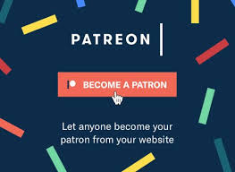<!-- .element: style="width:40%;float:right;margin-right:-1em;" -->

===

"Passer au niveau supérieur", qu'est-ce que cela implique pour moi en tant que lectrice ? Je me suis beaucoup questionnée là-dessus, je n'ai pas encore totalement pris la mesure. Une chose est certaine : je ne pourrai pas toujours passer au niveau supérieur, pour des raison économiques je l'ai dit, mais pas seulement. Pour des raisons également d'engagement de ma part. 

En préparant cette communication, je me suis en fait abonnée "gratuitement" à une dizaine de comptes dont je n'ai pas pu parler ici. Le moins que l'on puisse dire, c'est que cela s'est avéré très fatiguant. Quand bien même Patreon se défend d'être une plateforme pas comme les autres, elle reste une plateforme, qui m'a envahie de notifications (très souvent le dimanche matin). Au début, j'y ai vu une contradiction avec le discours promotionnel de Patreon, mais en fait j'ai vite réalisé que c'était moi qui l'utilisais mal. 

Patreon n'est pas conçue pour suivre autant de profils. Elle engage, du côté de l'usager, une forme de sobriété ou d'écologie de l'attention qui oblige à opérer des choix (une poignée de comptes), qui sont des choix économiques mais également des choix attentionnels. Les contenus publiés sur Patreon, souvent approfondis, requièrent un engagement et une attention soutenue, contrairement aux plateformes sociales habituées aux contenus brefs et aux formes fragmentaires propres au micro-blogging. Bref, s'abonner c'est s'engager, c'est choisir ce que l'on va véritablement pouvoir lire, écouter ou regarder. C'est peut-être cela, cette nouvelle condition de ce que jack Conte appelle le "true fan", qui dans un sens est aussi devenu le "patron", le mécène de son créateur de contenu favori, sur la promesse d'une relation plus authentique. 

Cette relation n'est pas sans risque : à mon sens, il s'agit toujours d'un moyen de monétiser la relation parasociale, c'est-à-dire ce lien affectif unilatéral qu’un individu développe avec une personnalité médiatique, mais en responsabilisant cette relation. Dans un tel contexte, Patreon n’annoncerait-elle pas la fin de la culture de la participation ? Là où le recrutement et l’activation de la participation des internautes sont une préoccupation majeure des gestionnaires de plateformes créatives et des organisateurs d’opérations participatives, la plateforme Patreon aurait donc tendance à diminuer les effets de surproduction et de spectacularisation. Elle semble, pour le moment, poser les conditions d’une sociabilité numérique d’un genre nouveau, fondée sur l’expertise du lecteur, sur sa contribution financière directe, et non plus sur une gestion algorithmique avide de capter l’attention du lecteur pour mieux la monétiser. Mais l'imaginaire du "web d'avant" qu'elle utilise dans son discours marketting me semble assez factice.

§§§§§§§§§§§§§§§§§§§§§§§§§§§§§§§§§§§§§§§§§§§§§

## Merci !